# Inference Exchange — Alpha System Design Specification

**Status:** Draft for review

**Companion to:** [Alpha Protocol Spec](security/alpha-protocol-spec.md) (covers security/crypto).
This document covers the operational system: matching, caching, billing, context management, session lifecycle, and provider fleet behavior.

## Table of Contents

1. [Request Lifecycle](#1-request-lifecycle)
2. [Matching Engine](#2-matching-engine)
3. [KV Cache and Session Affinity](#3-kv-cache-and-session-affinity)
4. [Context Window Management](#4-context-window-management)
5. [Billing in Confidential Mode](#5-billing-in-confidential-mode)
6. [Provider Fleet Management](#6-provider-fleet-management)
7. [Fallback Routing](#7-fallback-routing)
8. [Formal Operational Properties](#8-formal-operational-properties)
9. [Open Questions](#9-open-questions)

---

## 1. Request Lifecycle

### 1.1 End-to-end flow (operational view)

The protocol spec defines message formats and crypto. This section defines the system behavior — what happens at each step from the coordinator and provider's perspective.

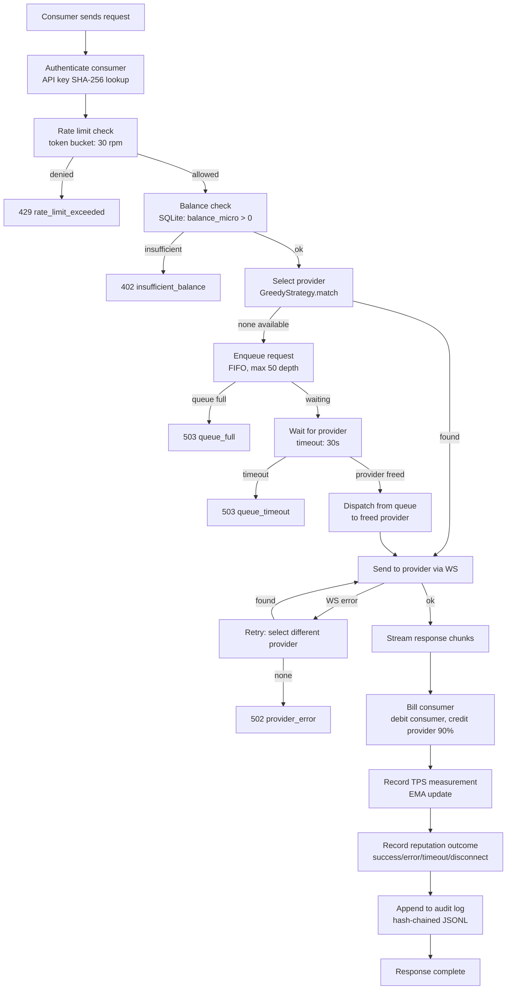

### 1.2 Timing budget

| Step | Expected latency | Hard timeout |
|---|---|---|
| Auth + rate limit + balance | < 1ms | — |
| Provider selection (matching) | < 5ms | — |
| Queue wait (if no provider) | 0–30s | 30s |
| Provider WS send | < 10ms | — |
| Time to first token (TTFT) | 100ms–5s (model/hardware dependent) | 120s |
| Token streaming | Duration depends on output length | 120s idle timeout per chunk |
| Billing + TPS + reputation | < 1ms | — |

Total worst case for a queued request: 30s queue + 5s TTFT + generation time.

---

## 2. Matching Engine

### 2.1 Current scoring model

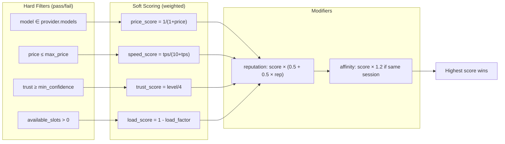

**Weights by preference:**

| Preference | w_price | w_speed | w_trust | w_load |
|---|---|---|---|---|
| `cheapest` | 0.6 | 0.15 | 0.1 | 0.15 |
| `fastest` | 0.1 | 0.6 | 0.1 | 0.2 |
| `most_secure` | 0.1 | 0.1 | 0.6 | 0.2 |
| `balanced` | 0.35 | 0.25 | 0.2 | 0.2 |

### 2.2 Known issues with current scoring

**Problem 1: Session affinity is a fixed bonus.** The 20% score boost for session affinity doesn't reflect whether a KV cache hit will actually occur. See section 3.

**Problem 2: TPS is from registration, not observed.** `measured_tps` comes from the provider's self-report at registration time. The TPS tracker measures actual performance via EMA, but the matching engine uses the registration value, not the observed value for providers with enough measurements.

**Problem 3: Context length is not a routing constraint.** A request with 32K tokens of history can be routed to a provider with `n_ctx=4096`. See section 4.

**Problem 4: Scoring weights are not validated.** The weights were hand-tuned. No A/B testing or trace analysis has been done to validate they produce good outcomes.

### 2.3 Alpha-target matching improvements

| Improvement | Priority | Issue |
|---|---|---|
| Use observed TPS (EMA) when available (≥3 measurements) | High | #33 |
| Add `context_length` as hard filter | High | #32, #33 |
| Cache-aware affinity (see section 3) | Medium | #30, #33 |
| Log scoring traces for post-hoc weight analysis | Low | #33 |

---

## 3. KV Cache and Session Affinity

### 3.1 How KV cache works in llama.cpp

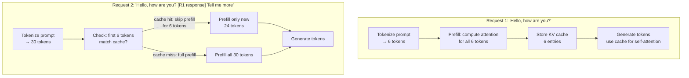

Cache hits happen when consecutive requests share a common prompt prefix. In a multi-turn conversation, each turn appends to the previous history, so the prefix grows monotonically — ideal for caching.

**Cache hit benefit:** proportional to `cached_tokens / total_input_tokens`. If 2048 of 4096 input tokens are cached, prefill work is halved. On Apple Silicon at ~1000 tok/s prefill speed, that's ~2 seconds saved.

**Cache invalidation:** the KV cache is per-model-instance. It's evicted when:
- A different model is loaded
- The cache fills up (bounded by `n_ctx`)
- The process restarts
- The context is explicitly reset

### 3.2 Cache-aware session affinity design

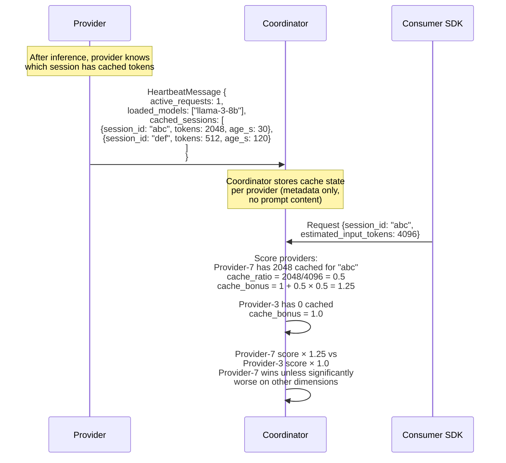

**Proposed scoring change:**

```python
# Current (flat bonus):
if order.session_affinity_provider_id == offer.provider_id:
    score *= 1.2

# Proposed (cache-proportional bonus):
cached_tokens = provider.cached_sessions.get(session_id, 0)
if cached_tokens > 0 and estimated_input_tokens > 0:
    cache_ratio = min(cached_tokens / estimated_input_tokens, 1.0)
    score *= (1.0 + cache_ratio * CACHE_BONUS_MAX)  # CACHE_BONUS_MAX = 0.5
```

This means:
- Full cache hit (all input tokens cached): 50% bonus
- Half cache hit: 25% bonus
- No cache: no bonus
- The bonus is proportional to actual expected benefit, not arbitrary

### 3.3 Cache state reporting

The provider's heartbeat adds a `cached_sessions` field:

```json
{
  "type": "heartbeat",
  "active_requests": 1,
  "loaded_models": ["llama-3-8b"],
  "cached_sessions": [
    {"session_id": "abc123", "cached_tokens": 2048, "age_seconds": 30},
    {"session_id": "def456", "cached_tokens": 512, "age_seconds": 120}
  ]
}
```

**Confidential mode safety:** `session_id` is a UUID generated by the consumer — it's routing metadata, not content. The coordinator already knows which sessions exist (it routed the original requests). Reporting token counts per session reveals how much was processed, which the coordinator already knows from billing. No new information is leaked.

**Eviction:** cached sessions with `age_seconds > CACHE_TTL` (e.g., 300s) should be dropped from reports. The coordinator should also drop affinity entries older than TTL.

### 3.4 Statelessness tension

The PCC comparison doc identifies that KV cache persistence conflicts with the statelessness principle. The operational stance for alpha:

- KV cache IS used for performance (sessions benefit from affinity)
- KV cache is NOT zeroed between requests within a session (performance cost would negate the benefit)
- KV cache SHOULD be zeroed when a session ends (the session key derivation is per-session, so cache from session A is useless for session B anyway)
- This means: within a session, the provider holds inference state. Between sessions, it should not.

Related: #30 (cache measurement), #33 (matching improvements), PCC comparison (statelessness section)

---

## 4. Context Window Management

### 4.1 The problem

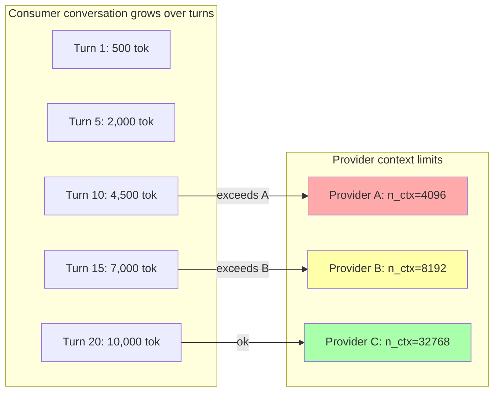

Each turn sends the full conversation history. Eventually it exceeds some providers' context windows.

### 4.2 Current behavior (unspecified)

- `ProviderCapabilities` doesn't include `context_length`
- The matching engine doesn't filter by context capacity
- llama-cpp behavior on overflow: depends on build. May truncate silently, error, or produce garbage.
- In confidential mode, the coordinator can't see the messages to estimate length

### 4.3 Proposed design

```mermaid
flowchart TD
    REQ[Consumer request] --> EST{SDK estimates<br/>input tokens locally}
    EST --> META["Include estimated_input_tokens<br/>in request metadata<br/>(not encrypted)"]

    META --> COORD[Coordinator receives request]
    COORD --> FILTER{"Filter providers:<br/>provider.context_length ≥<br/>estimated_input_tokens + max_tokens"}
    FILTER -->|"no providers with<br/>enough context"| ERR[400 context_too_large<br/>"Conversation exceeds available<br/>provider context. Reduce history<br/>or request a larger-context provider."]
    FILTER -->|"providers available"| MATCH[Normal matching<br/>among eligible providers]

    MATCH --> PROV[Provider receives request]
    PROV --> DEC[Decrypt + tokenize]
    DEC --> CHECK{actual_tokens ><br/>n_ctx - max_tokens?}
    CHECK -->|"ok"| INFER[Run inference]
    CHECK -->|"overflow"| PERR["Return structured error:<br/>context_overflow<br/>{actual_tokens, context_limit}"]
```

**Key decisions:**

1. **SDK estimates tokens locally** using the same ~4 chars/token heuristic, included as `estimated_input_tokens` in the (unencrypted) request metadata. This is safe in confidential mode — it reveals approximate conversation length (which the coordinator can already infer from ciphertext size) but not content.

2. **Coordinator filters by context capacity** before matching. This prevents routing a long conversation to a provider that can't handle it.

3. **Provider validates after decryption** as a second check. The SDK estimate may be wrong (different tokenizers, non-English text). If the actual token count exceeds the limit, the provider returns a structured `context_overflow` error.

4. **`context_length` is added to `ProviderCapabilities`** so providers advertise their limit at registration.

### 4.4 SDK-side conversation management

For consumers building chatbots / multi-turn applications, the SDK should provide helpers:

```python
# Track approximate token usage
sdk.estimated_tokens  # running total for current session

# Warn before hitting limits
if sdk.estimated_tokens > provider_context * 0.8:
    # "Conversation is approaching context limit"

# Truncation strategies (future, not alpha):
# - Drop oldest messages (keep system prompt + last N turns)
# - Summarize old context (requires an extra inference call)
# - Rotate to a new session with a summary
```

For alpha, the minimum viable behavior is: the coordinator rejects requests that are estimated to exceed the provider's context, and the error message tells the consumer why.

Related: #32 (context overflow), #33 (matching — context as hard filter)

---

## 5. Billing in Confidential Mode

### 5.1 The trust problem

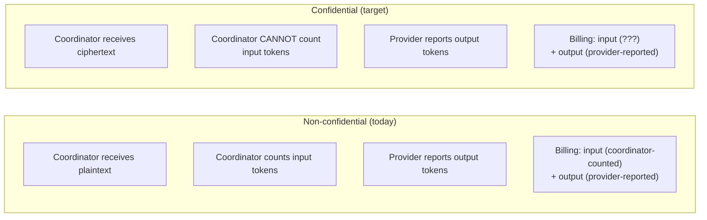

In confidential mode, the coordinator can't count tokens because it can't see the messages. Both input and output token counts come from either:
- The provider (who decrypts and counts)
- The SDK's estimate (pre-encryption)

### 5.2 Billing design for alpha

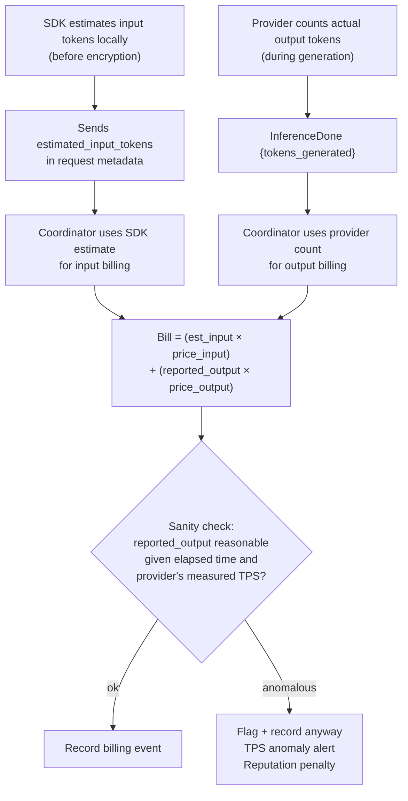

**Trust model for alpha:**

| Token count | Source | Trust level |
|---|---|---|
| Input tokens | SDK estimate (metadata) | Medium — consumer has no incentive to lie (they pay more for higher estimates). Under-reporting saves them money but the coordinator can cross-check against ciphertext size. |
| Output tokens | Provider report | Low — provider could over-report to earn more. Mitigated by TPS anomaly detection: if a provider claims 1000 tokens in 2 seconds but their measured TPS is 60, something is wrong. |

**Ciphertext size cross-check:** the coordinator can estimate input tokens from `len(encrypted_envelope)`. Encryption adds ~40 bytes overhead (nonce + tag) but the ciphertext length is proportional to plaintext length. If the SDK claims 100 tokens but the ciphertext is 50KB, something doesn't add up.

### 5.3 Formal billing property (confidential mode)

```
∀ requests r on the confidential path:
  bill(r).input_tokens = SDK_estimate(r)  ← consumer-provided
  bill(r).output_tokens = provider_report(r)  ← provider-provided
  
  Conservation still holds:
  bill(r).cost = bill(r).provider_earning + bill(r).platform_fee
  
  Accuracy is approximate:
  |SDK_estimate(r) - actual_input(r)| ≤ ε  (tokenizer variance)
  |provider_report(r) - actual_output(r)| ≤ δ  (trust assumption)
```

This is weaker than non-confidential billing (where the coordinator counts inputs exactly). The tradeoff is explicit: confidentiality costs billing precision.

Related: #31 (electricity costs interact with billing accuracy)

---

## 6. Provider Fleet Management

### 6.1 Provider lifecycle

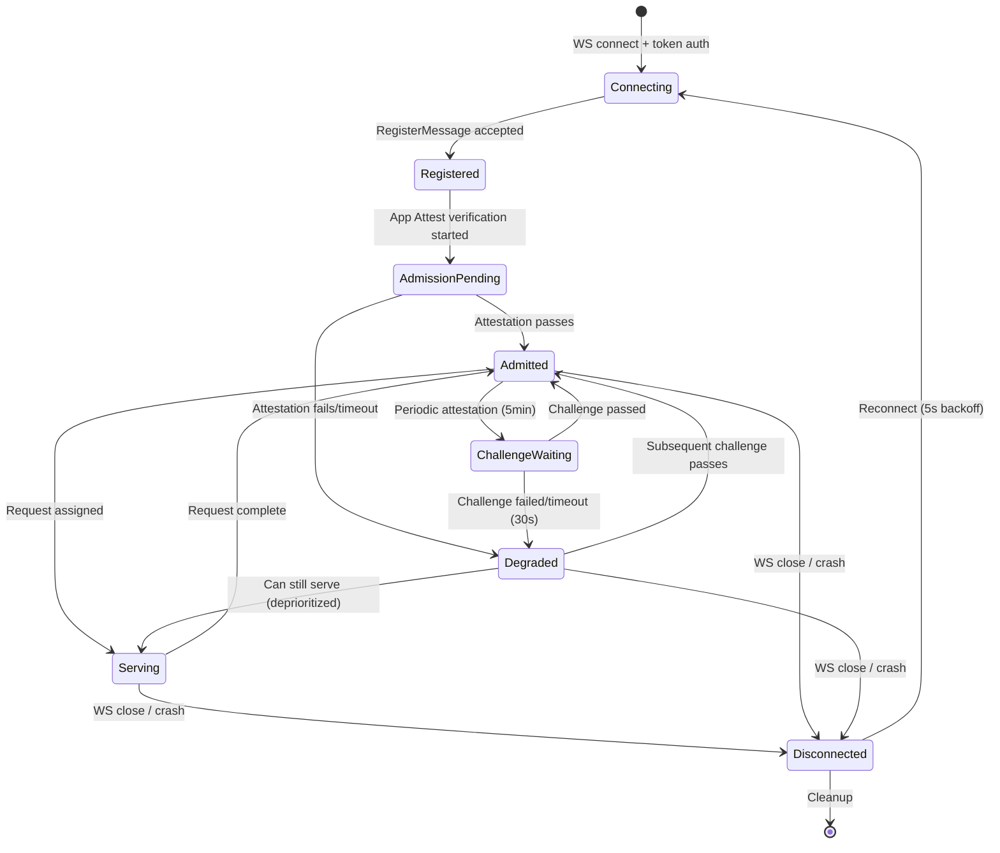

### 6.2 Provider health monitoring

The OCIP agent monitors the inference server independently:

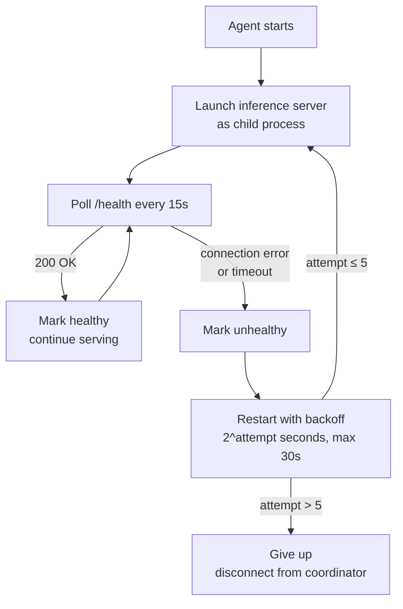

### 6.3 Request dispatch on provider free

When a provider completes a request (InferenceDone or InferenceError), the coordinator checks the pending queue:

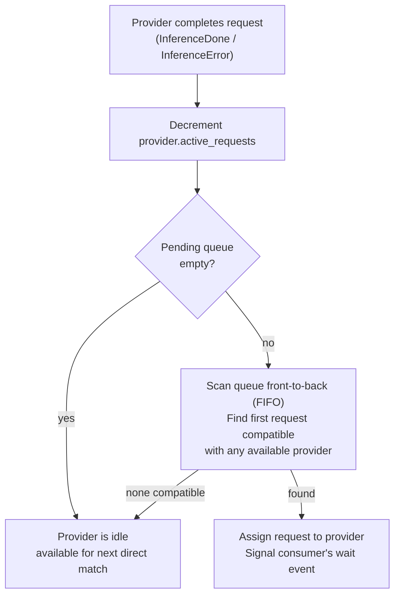

### 6.4 TPS tracking

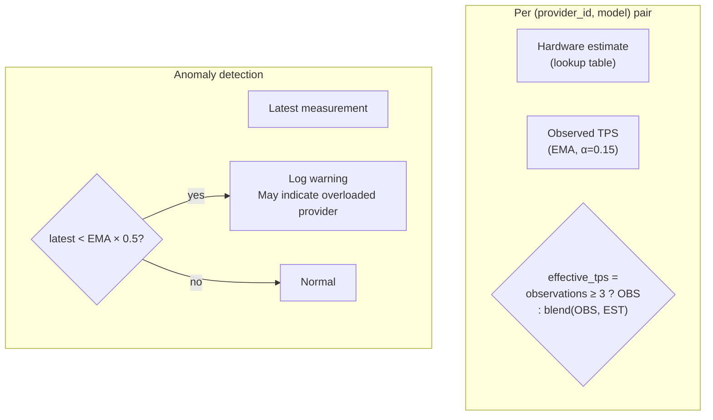

### 6.5 Reputation

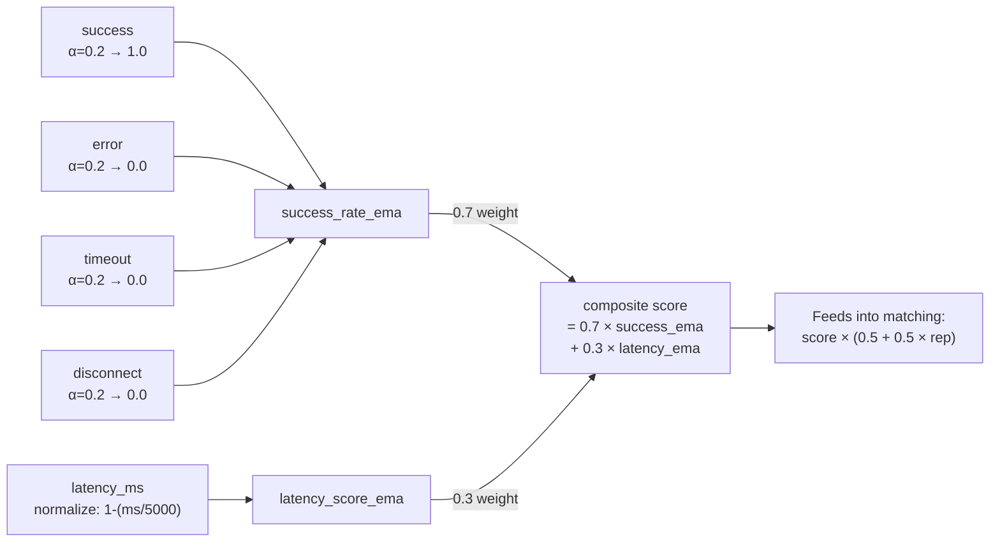

New providers start at 0.5 (neutral). After 5+ requests with < 50% success rate, they're marked degraded and deprioritized.

---

## 7. Fallback Routing

### 7.1 Decision tree

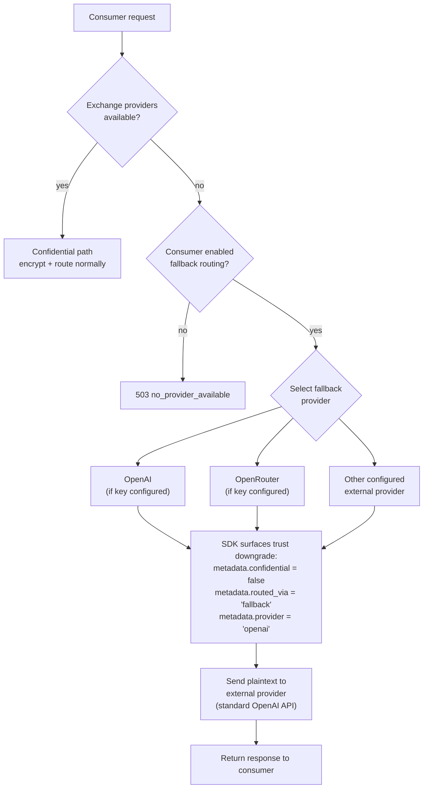

### 7.2 Fallback configuration

```python
# In SDK initialization:
client = OpenAI(
    http_client=ConfidentialTransport(
        api_key="sk-ie-...",
        fallback_enabled=True,
        fallback_providers=[
            {"provider": "openai", "api_key": "sk-..."},
            {"provider": "openrouter", "api_key": "sk-or-..."},
        ],
        fallback_notify=True,  # log a warning when fallback is used
    )
)
```

### 7.3 Important: fallback is a trust downgrade

The SDK MUST make it clear to the consumer when a request was routed through a fallback provider. The response metadata should indicate:
- `confidential: false` — this request was NOT end-to-end encrypted
- `routed_via: "fallback"` — the exchange had no providers; an external API was used
- `provider: "openai"` — which external provider served it

The consumer code can check this and decide whether to proceed or abort. For alpha, a logged warning is sufficient. For production, this should be a callback or exception the consumer can handle.

Related: #26 (fallback routing issue)

---

## 8. Formal Operational Properties

### 8.1 Matching correctness

**Property M1: Hard constraint satisfaction**

```
∀ matches (order, offer):
  order.model ∈ offer.models ∨ order.model = "default"
  ∧ offer.price_per_mtok_output ≤ order.max_price_per_mtok
  ∧ offer.confidence_level ≥ order.min_confidence
  ∧ offer.available_slots > 0
```

No match violates hard constraints. Tested in `test_matching.py`.

**Property M2: Greedy optimality**

```
∀ matches m by GreedyStrategy:
  ¬∃ offer o : o is eligible ∧ score(order, o) > score(order, m.offer)
  ∧ o.available_slots > 0 at time of matching
```

Greedy picks the highest-scoring eligible provider. This is locally optimal (best for this request) but not globally optimal (batch auction can do better across multiple simultaneous requests).

**Property M3: FIFO fairness for queued requests**

```
∀ requests r1, r2 in the pending queue:
  r1.queued_at < r2.queued_at
  ⟹ r1 is dispatched before r2
  (if both are compatible with the freed provider)
```

First-in, first-out. The queue scan dispatches the oldest compatible request.

### 8.2 Billing correctness

**Property B1: Conservation of value** (same as protocol spec F1)

```
∀ billing events:
  Σ cost = Σ provider_earning + Σ platform_fee
```

**Property B2: Minimum charge**

```
∀ bills b:
  b.cost_micro ≥ 100  (minimum $0.0001)
```

Prevents zero-charge requests that would consume provider resources without payment.

**Property B3: Proportional scaling**

```
∀ bills b1, b2 with same price:
  b1.tokens = k × b2.tokens
  ⟹ |b1.cost - k × b2.cost| ≤ 1  (integer rounding)
```

Cost scales linearly with token count. Tested in `test_billing.py`.

### 8.3 Cache properties

**Property KV1: Affinity bonus monotonicity**

```
∀ providers p with cached_tokens(session_id) > 0:
  cache_bonus(p, session_id) > cache_bonus(q, session_id)
  where q has cached_tokens(session_id) = 0
```

A provider with warm cache for this session always gets a higher bonus than one without.

**Property KV2: Bonus proportionality**

```
∀ requests r with estimated_input_tokens > 0:
  cache_bonus(p, r) = 1 + min(cached_tokens/estimated_input, 1) × MAX_BONUS
```

Bonus is proportional to expected benefit, capped at `MAX_BONUS`.

**Property KV3: Cache expiry**

```
∀ cached_sessions s:
  age(s) > CACHE_TTL ⟹ s is not reported in heartbeat
  ∧ s is not considered for affinity scoring
```

Stale cache entries don't influence routing.

### 8.4 Context management

**Property CTX1: No silent overflow**

```
∀ requests r routed to provider p:
  estimated_input_tokens(r) + max_tokens(r) ≤ p.context_length
  ∨ error(context_too_large) is returned before routing
```

No request is silently sent to a provider that can't fit it.

**Property CTX2: Provider-side validation**

```
∀ requests r decrypted by provider p:
  actual_tokens(r) > p.n_ctx - r.max_tokens
  ⟹ error(context_overflow) returned with actual count and limit
```

Even if the SDK estimate was wrong, the provider catches it and returns a structured error.

### 8.5 Availability

**Property AV1: Queue bounded**

```
pending_queue.size ≤ QUEUE_MAX_DEPTH (50)
```

The system never accumulates unbounded queued requests.

**Property AV2: Timeout bounded**

```
∀ queued requests r:
  wait_time(r) ≤ QUEUE_TIMEOUT_SECONDS (30)
  ⟹ r is either dispatched or rejected
```

No request waits forever.

**Property AV3: Provider disconnect cleanup**

```
∀ disconnected providers p:
  ∀ in-flight requests r assigned to p:
    InferenceError("provider_disconnected") is pushed to r's response queue
```

No consumer hangs waiting for a response from a dead provider.

---

## 9. Open Questions

These need answers before or during alpha implementation:

### 9.1 Cache

- What is the actual TTFT improvement from a KV cache hit on Apple Silicon? Need measurements (#30) before calibrating `CACHE_BONUS_MAX`.
- Does llama-cpp automatically detect prefix cache hits, or does the caller need to signal "these first N tokens are cached"?
- What happens to the KV cache when `max_concurrent > 1` and two requests share the same provider? Do they share cache or get independent cache slots?

### 9.2 Billing

- Is the ciphertext-size cross-check (section 5.2) reliable enough to detect a consumer deliberately under-reporting input tokens? The ratio of ciphertext bytes to tokens depends on language, encoding, and JSON overhead.
- Should there be a reconciliation mechanism where the provider reports actual input tokens after decryption, and the coordinator compares against the SDK estimate?

### 9.3 Context

- Should `estimated_input_tokens` be a hard requirement in the confidential request format, or optional? If optional, the coordinator can't filter by context length.
- How should the SDK estimate tokens for non-English text (where the ~4 chars/token heuristic is significantly off)?

### 9.4 Matching

- Should the batch auction strategy be used for alpha, or is greedy sufficient? Batch is implemented but untested in production-like conditions.
- When multiple sessions from the same consumer are active (e.g., parallel chat windows), should they all stick to the same provider or load-balance?

### 9.5 Fleet

- What should the attestation challenge interval be? Currently 5 minutes. Is that too frequent (overhead) or too infrequent (stale evidence)?
- Should degraded providers be fully excluded from routing, or just deprioritized? Currently deprioritized via reputation, but a consumer requesting `min_confidence=hardened` could still be routed to a degraded provider if its trust_level was originally hardened.

---

## References

- [Alpha Protocol Spec](security/alpha-protocol-spec.md) — security/crypto companion
- [L2 Threat Model](security/threat-model.md)
- [PCC Comparison](security/pcc-comparison.md)
- [Architecture](architecture.md)
- Issues: #30 (cache), #31 (electricity), #32 (context), #33 (matching)
