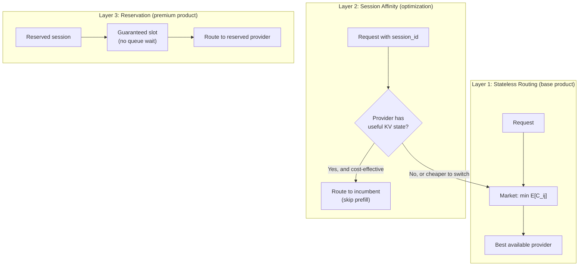
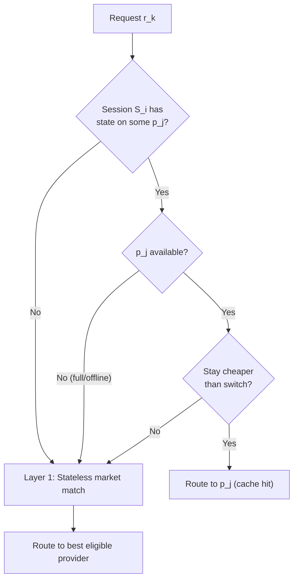
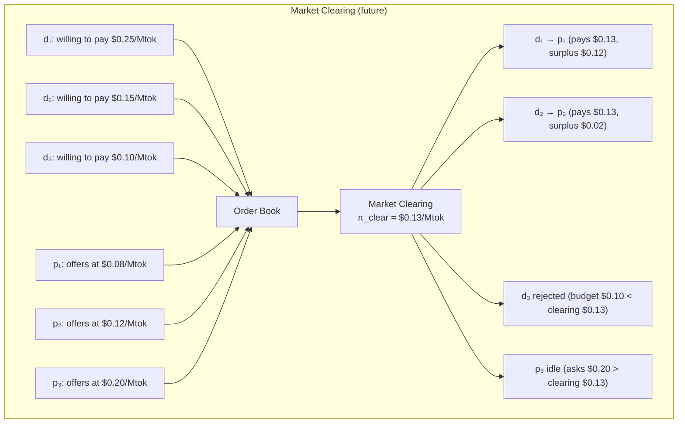

# Formal Model — Inference Exchange from First Principles

A mathematical specification of an open market for inference capacity.
Tokens are the metering unit; the scarce assets are compute slots, model
residency, KV state, latency, and trust.

The fundamental tradeable unit is the **inference request**. Session
affinity (KV cache reuse) and capacity reservations are optional
optimization layers — the marketplace works without them.

Every statement is categorized as one of:
- **Axiom**: physical or mathematical fact we assume without proof
- **Definition**: a term we define for use in the model
- **Proposition**: a statement derivable from the axioms and definitions
- **Economic convention**: an accounting rule we choose (could be different)
- **Mechanism choice**: a market-design decision (alternatives exist)

---

## 0. Physical Assumptions

**Axiom 0 (Propagation Bound).** Information between points separated by
distance $d$ over fiber has minimum one-way latency $\tau_{\min} = d / c_f$
where $c_f \approx 2 \times 10^8$ m/s.

**Axiom 1 (Compute Lower Bound).**

*Decode phase (sequential token generation):* Each decode step reads the
full model weights from memory. The memory-bandwidth roofline for single-
request decode throughput is:

$$T_{\text{roofline}} = \frac{B}{2 P b / 8}$$

where $B$ = memory bandwidth, $P$ = parameters, $b$ = bits per weight.
This is an *estimate*, not a hard ceiling — speculative decoding, batched
requests sharing weight reads, and implementation details (weight caching,
prefetch) can push observed throughput above the single-request roofline.
However, no implementation can avoid reading the weights at least once
per decode step, so $\Omega(P \cdot b / 8)$ bytes per token is a true
lower bound for a single forward pass.

*Prefill phase (parallel input processing):* Dense self-attention over
$n$ tokens requires $O(n^2 \cdot d_h)$ FLOPS per layer for the QK^T
computation. This is the cost of *standard dense attention*. Modern
implementations using FlashAttention, paged attention, chunked prefill,
or sparse/sliding-window architectures achieve better constants or
subquadratic scaling for specific architectures. The $O(n^2)$ bound
applies to the dense attention component; actual prefill cost depends
on the model architecture and attention implementation.

The key consequence for the exchange: **for dense-attention models, marginal
prefill cost generally increases with context length.** This makes cache
reuse economically valuable. The exact scaling of $C_{\text{prefill}}(n)$ is
model- and architecture-dependent, but the fundamental economic statement
requires only:

$$C_{\text{prefill}}(n_{\text{fresh}}) < C_{\text{prefill}}(n_{\text{full}}) \quad \text{whenever } n_{\text{fresh}} < n_{\text{full}}$$

That is, prefilling fewer tokens costs less than prefilling more tokens.
This holds for all practical architectures and is the basis for cache
economics — not the specific $O(n^2)$ exponent.

**Axiom 2 (Computational Hardness of Key Recovery).** For a symmetric cipher
with $k$-bit keys, generic brute-force search requires $O(2^k)$ operations.
For collision resistance of a hash with $k$-bit output, the birthday bound
gives $O(2^{k/2})$ operations. X25519 ECDH security rests on the hardness
of the Computational Diffie-Hellman (CDH) problem on Curve25519, estimated
at ~128-bit security.

**Axiom 3 (Hardware Root of Trust).** A hardware co-processor that generates
and stores a private key $\text{sk}$ such that no software-accessible bus
exports $\text{sk}$ provides a *trust anchor*. The binding between a physical
device and a public key $\text{pk}$ is verifiable only if the manufacturer
signs a certificate chain $\text{Cert}(\text{pk}, \text{device\_id})$.

**Axiom 4 (Coordinator Trust Boundary).** Any centralized coordinator that
can observe plaintext represents a single point of compromise. Security
claims depending on honest coordinator behavior are operational assumptions,
not cryptographic guarantees.

**Axiom 5 (State Locality).** The KV cache produced during prefill of
$n$ tokens occupies:

$$M_{\text{KV}} = \frac{2 \cdot n \cdot L \cdot h_{\text{KV}} \cdot d_h \cdot b_{\text{KV}}}{8} \text{ bytes}$$

where $L$ = layers, $h_{\text{KV}}$ = number of KV heads (NOT attention heads),
$d_h$ = head dimension, $b_{\text{KV}}$ = KV cache precision in bits. The
factor of 2 accounts for both K and V tensors.

For GQA/MQA models (Llama 3.x, Qwen 2.5, etc.), $h_{\text{KV}}$ can be
4-8× smaller than $h_{\text{attn}}$, making KV cache substantially smaller
than a naive $O(n \cdot d_{\text{hidden}} \cdot L)$ estimate. This directly
affects cache economics: GQA models are cheaper to keep cached.

Transferring $M_{\text{KV}}$ between machines costs $M_{\text{KV}} / B_{\text{net}}$
seconds. For large contexts on typical networks, transfer time exceeds
recomputation time.

**Consequence:** KV cache state is economically bound to the machine that
computed it. This is the physical basis for session affinity.

---

## 1. Definitions

### 1.1 Primitives and Layers

The system has one fundamental primitive and two optional optimization layers.

**Definition 1 (Inference Request — fundamental primitive).** A single
invocation of an autoregressive model:

$$r = (m, \mathbf{x}_{\text{in}}, n_{\text{max}}, \theta)$$

The request is the atomic tradeable unit. The marketplace exists even if
sessions and reservations don't — a stateless request router is the base
product.

**Definition 2 (Session — optional state).** An ordered sequence of requests
sharing conversational context:

$$S = (r_1, r_2, \ldots, r_K)$$

where request $r_k$ includes accumulated context:

$$\mathbf{x}_{\text{in}}^{(k)} = \text{sys} \| \text{turn}_1 \| \cdots \| \text{turn}_{k-1} \| \text{new}_k$$

A session creates an *affinity* to a provider (the one holding the KV cache),
but does NOT require a dedicated provider. One provider serves many sessions
concurrently:

$$\text{Provider } p_j: \{S_1, S_2, \ldots, S_N\} \quad (N \gg 1 \text{ typical})$$

**Definition 3 (Session Affinity — optional optimization).** When session
$S_i$ has state on provider $p_j$, the affinity value is the economic
benefit of reusing that state vs. switching providers:

$$A(S_i, p_j) = V_{\text{cache-reuse}} - V_{\text{cache-reuse-on-best-alternative}}$$

If $A > 0$, prefer $p_j$ for the next request in $S_i$. If $A \leq 0$
(another provider is cheaper enough to justify re-prefill), switch.

Affinity is a *soft preference*, not an exclusive binding. The provider
is not "owned" by the session.

**Definition 4 (Reservation — optional premium product).** A time-bounded
guarantee of capacity:

$$R = (p_j, m, s_{\text{reserved}}, \Delta t, \pi^{\text{reservation}})$$

Reservations are a distinct product from on-demand routing. They guarantee
a slot is available, preventing queue-wait. They are economically meaningful
only when capacity is scarce or the consumer needs SLA guarantees.

Most consumers use on-demand routing (no reservation). Reservations are
for enterprise/latency-critical use cases.

### 1.2 The Three-Layer Architecture

| Layer | What it does | Who needs it | Provider relationship |
|---|---|---|---|
| 1. Stateless routing | Best-effort, per-request | Everyone (default) | Many-to-many |
| 2. Session affinity | Soft preference for cached provider | Multi-turn conversations | Many sessions per provider |
| 3. Reservation | Guaranteed capacity | Enterprise / SLA | Slot reservation, not provider dedication |

The marketplace works at Layer 1. Layers 2 and 3 are strictly additive
optimizations that improve economics and latency but are not required.

**Definition 4 (Cached Prefix).** The longest common prefix between the
session's current context and the provider's KV cache:

$$P(S, p_j) = \text{longest common prefix}(\mathbf{x}_{\text{in}}^{(k)},\; \text{cache}(p_j, S))$$

Then:

$$n_{\text{cached}} = |P(S, p_j)|, \qquad n_{\text{fresh}} = n_{\text{in}}^{(k)} - |P(S, p_j)|$$

This is the economically relevant quantity — not "how many tokens are cached"
but "how many tokens of *this specific prefix* are cached."

### 1.2 Participants

$$\mathcal{S} = \mathcal{C}\text{onsumers} \cup \mathcal{P}\text{roviders} \cup \{\mathcal{X}\}$$

A **consumer** $c_i$ holds keypair $(sk_i^c, pk_i^c)$, submits session demands.
A **provider** $p_j$ holds keypair $(sk_j^p, pk_j^p)$, publishes capacity offers.
The **coordinator** $\mathcal{X}$ matches demands to offers, manages leases,
meters usage, relays encrypted traffic.

### 1.3 Trust Levels

**Definition 5.** Trust levels $\mathcal{L} = \{L_0, L_1, L_2, L_3\}$ are
ordered by the security guarantees the provider environment offers across
three dimensions: **Confidentiality** (C), **Integrity** (I), and
**Availability** (A).

| Level | Confidentiality | Integrity | Availability | What the operator CAN do |
|---|---|---|---|---|
| $L_0$ | None | None | Full control | Read memory, debug, inject code, replace binaries |
| $L_1$ | Transport only | None | Full control | Everything at L0 except observe network traffic |
| $L_2$ | Process-level | Process-level | Can kill process | Kill/restart process, observe resource usage (CPU/RAM/GPU) |
| $L_3$ | Hardware-level | Hardware-level | Can power off | Physical denial of service only |

The ordering $L_0 < L_1 < L_2 < L_3$ reflects **monotonically increasing
confidentiality guarantees**, which is the primary dimension for inference
privacy. Note that L2 is not strictly "more of everything" than L1 — L1
operators retain more control over process internals. The ordering is
justified because for the exchange's core use case (protecting prompt
confidentiality), L2's anti-debug/anti-inspection guarantees are strictly
stronger than L1's transport-only encryption.

For consumers, the trust level answers one question: "Can the provider
operator read my prompts?" L0: yes. L1: in transit no, in memory yes.
L2: requires kernel exploit. L3: requires physical hardware attack.

**Proposition 1 (Monotonicity of Privacy).** $\ell' > \ell \implies \mathcal{P}_{\ell'} \subseteq \mathcal{P}_{\ell}$.
Higher trust strictly reduces the eligible provider set.

*Proof:* Follows directly from the total ordering and the eligibility
predicate requiring $\ell_j \geq \ell_{\min}$. $\square$

**Consequence:** Privacy costs availability. This is the fundamental tradeoff.

---

## 2. Provider Supply

### 2.1 Capacity Offer

A provider publishes:

$$a_j = (p_j,\; M_j,\; \ell_j,\; \pi_j,\; T_j,\; s_j,\; K_j,\; \sigma_j,\; \text{hw}_j)$$

where:
- $M_j$: loaded models
- $\ell_j$: trust level
- $\pi_j = (\pi_j^{\text{prefill}}, \pi_j^{\text{decode}}, \pi_j^{\text{cache}}, \pi_j^{\text{reservation}})$: four-rate price vector
- $T_j = (T_j^{\text{decode}}, T_j^{\text{prefill}})$: throughput
- $s_j = (s_j^{\text{free}}, s_j^{\text{total}})$: slots
- $K_j = \{(S_k, m_k, n_k, t_k^{\text{last}}, t_k^{\text{expiry}}, h_k^{\text{prefix}})\}$: cache entries
- $\sigma_j$: reputation
- $\text{hw}_j$: hardware descriptor

### 2.2 The Four Rates

| Rate | What it covers | Physical cost driver | Billing unit |
|---|---|---|---|
| $\pi^{\text{prefill}}$ | Fresh input tokens | Compute (superlinear in context) | per token |
| $\pi^{\text{decode}}$ | Output tokens | Memory bandwidth (sequential reads) | per token |
| $\pi^{\text{cache}}$ | Cached prefix tokens | Memory occupancy (holding KV state) | per token (derived) |
| $\pi^{\text{reservation}}$ | Holding a slot for a session | Opportunity cost of blocked capacity | per second |

**Economic convention:** $\pi^{\text{cache}} \leq \pi^{\text{prefill}}$.
The provider should charge less for cached tokens because they do less work.
But this is a market convention, not a physical law — providers set their
own rates.

**Note on cache cost economics:** The physical cost of holding KV cache is
fundamentally a memory-time product:

$$C_{\text{KV}} = M_{\text{KV}} \cdot \Delta t \cdot \pi_{\text{mem}}$$

where $M_{\text{KV}} = 2 n L h_{\text{KV}} d_h b_{\text{KV}} / 8$ bytes
($n$ = cached tokens, $L$ = layers, $h_{\text{KV}}$ = number of KV heads,
$d_h$ = head dimension, $b_{\text{KV}}$ = KV precision in bits). The factor
of 2 accounts for both K and V tensors.

For GQA/MQA models (e.g., Llama 3.x), $h_{\text{KV}} \ll h_{\text{attn}}$,
making KV cache substantially smaller than a naive hidden-dimension estimate.
This matters to the exchange: GQA models are cheaper to keep cached.

The per-token cache rate $\pi^{\text{cache}}$ exposed to consumers is a
**derived market price** — a convenient billing abstraction over the
underlying memory-time cost. The relationship is:

$$\pi^{\text{cache}} = f(L, h_{\text{KV}}, d_h, b_{\text{KV}}, \Delta t, \text{memory scarcity}, \text{opportunity cost})$$

In other words, $/cached-token is not the physical cost; it is a
market-denominated projection of a GB-seconds cost. This distinction
matters when comparing providers with different memory architectures
(e.g., Apple Silicon unified memory vs. discrete GPU VRAM).

**Mechanism choice:** The reservation rate $\pi^{\text{reservation}}$ is
a **time-based charge** ($/second), not a per-token charge. This is
economically correct because reservation cost scales with *duration*,
not with *token count*. A consumer holding a slot idle for 5 minutes
between turns costs the provider 5 minutes of opportunity cost regardless
of how many tokens were in the conversation.

On small Apple Silicon machines (1-2 slots total), the reservation rate
is significant — holding one slot blocks 50-100% of capacity. On large
multi-GPU servers (32+ slots), reservation cost per slot is marginal.
This creates natural price differentiation between dedicated small
providers and high-capacity infrastructure.

### 2.3 Supply Curves (future evolution)

**Mechanism choice:** Eventually, providers should submit a supply curve
rather than a flat price:

| Active sessions | Price |
|---|---|
| 1 | $0.10/Mtok |
| 2 | $0.13/Mtok |
| 3 | $0.21/Mtok |

This reflects the real opportunity cost: the marginal session on a
2-slot machine imposes congestion externalities on existing sessions
(lower throughput, higher latency). A supply curve makes the market
economically efficient. For the MVP, flat pricing is sufficient.

### 2.4 Throughput Estimates

**Proposition 2 (Decode Throughput Estimate).** The idealized single-request
memory-bandwidth upper bound for decode throughput is:

$$T_{\text{max}} = \frac{B_j}{P_m b / 8} = \frac{8 B_j}{P_m b}$$

In practice, effective memory bandwidth utilization varies by hardware and
implementation. Define an empirical utilization factor $\eta_j \in (0, 1]$:

$$T_{\text{estimate}} = \eta_j \cdot \frac{8 B_j}{P_m b}$$

Typical values of $\eta_j \approx 0.5$ on current hardware (due to access
patterns, bank conflicts, controller overhead). Some implementations
achieve higher utilization.

The table below uses $\eta = 0.5$ as a conservative practical estimate:

| Hardware | Bandwidth | $\eta$ | 7B Q4 estimate | 32B Q4 estimate |
|---|---|---|---|---|
| M4 Pro | 250 GB/s | 0.5 | ~31.7 tok/s | ~6.9 tok/s |
| M4 Max | 500 GB/s | 0.5 | ~63.5 tok/s | ~13.9 tok/s |
| M2 Ultra | 800 GB/s | 0.5 | ~101.6 tok/s | ~22.2 tok/s |
| RTX 4090 | 1008 GB/s | 0.5 | ~128.0 tok/s | ~28.0 tok/s |

These are single-request estimates. Multi-request batching amortizes weight
reads and can exceed these numbers. Speculative decoding produces multiple
tokens per forward pass. The numbers are useful for planning, not as hard
limits.

---

## 3. Consumer Demand

A consumer demand:

$$d_i = (c_i,\; m_i,\; \ell_i^{\min},\; \pi_i^{\max},\; \rho_i,\; S_i,\; \text{continuity}_i,\; L_i^{\max},\; T_i^{\min})$$

where:
- $m_i \in \mathcal{M} \cup \{\ast\}$: model ($\ast$ = any)
- $\ell_i^{\min}$: minimum trust level (**default: $L_2$**)
- $\pi_i^{\max}$: maximum price
- $\rho_i$: preference (cheapest, fastest, secure, balanced)
- $S_i$: session ID
- $\text{continuity}_i \in \{\text{prefer}, \text{require}, \text{none}\}$
- $L_i^{\max}$: max acceptable TTFT (latency constraint)
- $T_i^{\min}$: min acceptable decode throughput

---

## 4. Feasibility Constraints

**Definition 6 (Eligibility).** Provider $p_j$ is eligible for demand $d_i$ iff:

$$E(d_i, a_j) = \begin{cases} 1 & \text{if } (m_i = \ast \lor m_i \in M_j) \\ & \land\ \hat{C}(d_i, a_j) \leq \pi_i^{\max} \\ & \land\ \ell_j \geq \ell_i^{\min} \\ & \land\ s_j^{\text{free}} > 0 \\ & \land\ T_j^{\text{decode}} \geq T_i^{\min} \\ 0 & \text{otherwise} \end{cases}$$

where $\hat{C}(d_i, a_j)$ is the estimated per-request cost including all
four rates:

$$\hat{C}(d_i, a_j) = \hat{n}_{\text{fresh}} \cdot \pi_j^{\text{prefill}} + \hat{n}_{\text{cached}} \cdot \pi_j^{\text{cache}} + \hat{n}_{\text{out}} \cdot \pi_j^{\text{decode}} + \hat{t}_{\text{idle}} \cdot \pi_j^{\text{reservation}}$$

The consumer's $\pi_i^{\max}$ is a **budget constraint on total expected
request cost**, not just the decode rate. This prevents a provider with
cheap decode but expensive prefill from passing the filter and then
delivering a surprise bill.

For the first request in a session ($n_{\text{cached}} = 0$), this
simplifies to $\hat{n}_{\text{in}} \cdot \pi_j^{\text{prefill}} + \hat{n}_{\text{out}} \cdot \pi_j^{\text{decode}}$.
For subsequent requests with a warm lease, the cached portion reduces
the estimate.

All predicates are $O(1)$ given precomputed model-set membership and
estimated token counts.

---

## 5. Cost Model

### 5.1 Per-Request Cost

**Economic convention.** The cost of request $r_k$ in session $S$ on provider $p_j$:

$$C(r_k, p_j) = n_{\text{fresh}}^{(k)} \cdot \pi_j^{\text{prefill}} + n_{\text{cached}}^{(k)} \cdot \pi_j^{\text{cache}} + n_{\text{out}}^{(k)} \cdot \pi_j^{\text{decode}}$$

where $n_{\text{fresh}} + n_{\text{cached}} = n_{\text{in}}$ and the
cached count is $|P(S, p_j)|$ — the length of the common prefix (Definition 4),
not an arbitrary number reported by the provider.

### 5.2 Platform Fee

**Economic convention.**

$$C_{\text{consumer}} = C(r_k, p_j), \quad C_{\text{provider}} = (1 - \alpha) \cdot C, \quad C_{\text{platform}} = \alpha \cdot C$$

where $\alpha = 0.10$.

**Invariant S1 (Conservation):** $C_{\text{consumer}} = C_{\text{provider}} + C_{\text{platform}}$.

### 5.3 Expected Total Cost (the objective function)

**Definition 7.** The expected economic cost of assigning demand $d_i$
to provider $p_j$ over the expected remaining session horizon $H$:

$$\boxed{E[C_{ij}] = C_{\text{tokens}} + C_{\text{latency}} + C_{\text{disruption}} + C_{\text{reservation}}}$$

where:

$$C_{\text{tokens}} = n_{\text{fresh}} \cdot \pi_j^{\text{prefill}} + n_{\text{cached}} \cdot \pi_j^{\text{cache}} + \hat{n}_{\text{out}} \cdot \pi_j^{\text{decode}}$$

$$C_{\text{latency}} = \lambda_i \cdot E[\text{TTFT}_j(d_i)]$$

where $\lambda_i$ is the consumer's implicit value-of-time (derived from $\rho_i$;
$\lambda = 0$ for cheapest, high for fastest).

$$C_{\text{disruption}} = \hat{\theta}_j \cdot \left(C_{\text{retry}} + V_{\text{lost-cache}}\right)$$

This models disruption as a **single event class** with probability
$\hat{\theta}_j$ (from §8). When a provider fails, both consequences occur
together: the request must be retried AND the cached state is lost. There
is no double-counting because retry and cache loss are consequences of the
same failure event, not independent events.

$$C_{\text{retry}} = E[C_{i,j'}] + \tau_{\text{rematch}} \cdot \lambda_i$$

$$V_{\text{lost-cache}} = n_{\text{cached}} \cdot (\pi^{\text{prefill}} - \pi^{\text{cache}}) + \frac{n_{\text{cached}}}{T^{\text{prefill}}} \cdot \lambda_i$$

$$C_{\text{reservation}} = \pi_j^{\text{reservation}} \cdot E[\Delta t_{\text{idle}}]$$

where $\Delta t_{\text{idle}}$ is the expected idle time in seconds between
requests in this session. This is a fixed cost per lease interval, not a
per-token cost. For active conversations (messages every few seconds),
this is negligible. For sessions with long pauses (user thinking for
minutes), it can dominate.

### 5.4 Session Cost Over K Turns

**Proposition 3 (Quadratic Growth Without Cache).** For a $K$-turn session
with constant new-message size $\bar{n}$, constant model output $\bar{o}$,
and system prompt length $|\text{sys}|$, the input token count at turn $k$ is:

$$n_{\text{in}}^{(k)} = |\text{sys}| + k\bar{n} + (k-1)\bar{o}$$

Total input tokens across all turns:

$$N_{\text{in}}^{\text{total}} = \sum_{k=1}^{K} n_{\text{in}}^{(k)} = K|\text{sys}| + (\bar{n} + \bar{o})\frac{K(K-1)}{2} + K\bar{n}$$

The leading-order term is:

$$N_{\text{in}}^{\text{total}} = \frac{\bar{n} + \bar{o}}{2}K^2 + O(K)$$

*Proof:* $\sum_{k=1}^{K} k = K(K+1)/2$. The $k\bar{n}$ terms sum to
$\bar{n}K(K+1)/2$ and the $(k-1)\bar{o}$ terms sum to $\bar{o}K(K-1)/2$.
Combining: $\bar{n}K(K+1)/2 + \bar{o}K(K-1)/2 = (\bar{n}+\bar{o})K(K-1)/2 + K\bar{n}$. $\square$

**Crucially, previous model outputs are also part of subsequent context.**
The $\bar{o}$ terms contribute equally to the quadratic growth. A model
that produces long outputs (large $\bar{o}$) makes cache reuse even
more valuable.

Without cache, every token is prefilled every turn:

$$C_{\text{no-cache}} = \pi^{\text{prefill}} \cdot \left[\frac{\bar{n} + \bar{o}}{2}K^2 + O(K)\right] + \pi^{\text{decode}} \cdot K\bar{o}$$

With session affinity (same provider, all cache hits — only $\bar{n}$ new tokens per turn):

$$C_{\text{lease}} = \pi^{\text{prefill}} \cdot K\bar{n} + \pi^{\text{cache}} \cdot \left[\frac{\bar{n} + \bar{o}}{2}K^2 - K\bar{n} + O(K)\right] + \pi^{\text{decode}} \cdot K\bar{o}$$

**Proposition 4 (Affinity Savings).** With exact token accounting (no $O(K)$
terms), the total cached tokens across $K$ turns with session affinity are:

$$N_{\text{cached}} = (\bar{n} + \bar{o})\frac{K(K-1)}{2} + (K-1)|\text{sys}|$$

This counts: (a) all previously-seen user messages and model outputs that
are prefix-cached, and (b) the system prompt cached from turn 2 onward.

The exact savings are:

$$\boxed{\Delta C = (\pi^{\text{prefill}} - \pi^{\text{cache}}) \cdot \left[(\bar{n} + \bar{o})\frac{K(K-1)}{2} + (K-1)|\text{sys}|\right]}$$

This is positive iff $\pi^{\text{cache}} < \pi^{\text{prefill}}$ (nonzero
cache discount) and $K \geq 2$ (more than one turn). The savings grow
quadratically with $K$.

*Derivation:* Total input across all turns is
$N_{\text{in}} = K|\text{sys}| + \bar{n}K(K+1)/2 + \bar{o}K(K-1)/2$.
Total fresh tokens (what must be prefilled) is $|\text{sys}| + K\bar{n}$
(system prompt on turn 1, plus $\bar{n}$ new tokens each turn).
$N_{\text{cached}} = N_{\text{in}} - N_{\text{fresh}}$. $\square$

For $K = 10$, $\bar{n} = \bar{o} = 100$, $|\text{sys}| = 200$,
$\pi^{\text{cache}} = 0.1 \cdot \pi^{\text{prefill}}$: the lease saves
approximately 74% of total input costs.

**Important caveat:** This assumes the lease provider's prices equal the
alternative's. If the leased provider charges more per token, savings may
be offset — this is the stay-vs-switch condition (§6.2).

---

## 6. The Routing Problem

The routing problem has three layers, corresponding to the three-layer
architecture (§1.2). Layer 1 is always active. Layers 2-3 activate when
a session exists or a reservation is held.

### 6.1 Layer 1: Stateless Market Routing (the base product)

**Mechanism choice.** For demand $d_i$ without useful session state, select:

$$\boxed{j^* = \arg\min_{j \in E(d_i)}\; E[C_{ij}]}$$

This is pure cost-minimization over eligible providers. No session state,
no affinity, no reservation. This is the OpenRouter-equivalent behavior
and works for all single-turn requests and the first turn of any session.

The preference $\rho_i$ determines the objective through $\lambda_i$:

| $\rho$ | Objective | $\lambda_i$ |
|---|---|---|
| cheapest | $\min C_{\text{tokens}}$ | 0 |
| fastest | $\min C_{\text{tokens}} + \lambda \cdot E[\text{TTFT}]$ | high |
| secure | $\min C_{\text{tokens}}$ s.t. $\ell_j \geq L_3$ if possible | 0 |
| balanced | $\min E[C_{ij}]$ (full cost function) | moderate |

### 6.2 Layer 2: Session Affinity (optimization)

When a session $S_i$ has previous state on provider $p_j$ (KV cache), the
coordinator evaluates whether to stay or switch:

$$\Delta C = E[C_{ij'}^{\text{switch}}] - E[C_{ij}^{\text{stay}}]$$

$$\boxed{\text{Stay on } p_j \iff \Delta C > 0}$$

where:

$$E[C_{ij}^{\text{stay}}] = n_{\text{fresh}} \cdot \pi_j^{\text{prefill}} + n_{\text{cached}} \cdot \pi_j^{\text{cache}} + \hat{n}_{\text{out}} \cdot \pi_j^{\text{decode}} + \lambda_i \cdot \text{TTFT}_j^{\text{cached}}$$

$$E[C_{ij'}^{\text{switch}}] = n_{\text{in}} \cdot \pi_{j'}^{\text{prefill}} + \hat{n}_{\text{out}} \cdot \pi_{j'}^{\text{decode}} + \lambda_i \cdot \text{TTFT}_{j'}^{\text{full}}$$

Note: $V_{\text{lost-cache}}$ is implicit — switching means paying full
prefill cost instead of cached cost. The $\Delta C$ already captures this.

**Crucially, the provider is not dedicated.** Provider $p_j$ simultaneously
serves hundreds of sessions. Session affinity is a routing preference, not
a capacity reservation. If $p_j$ is full, the request falls through to
Layer 1 (stateless routing with full prefill cost).

### 6.3 Layer 3: Reservation (premium product)

**Mechanism choice.** For consumers who need guaranteed capacity:

$$R = (p_j, m, s_{\text{reserved}}, \Delta t, \pi^{\text{reservation}})$$

A reservation holds a slot on $p_j$ for duration $\Delta t$. The consumer
pays $\pi^{\text{reservation}} \cdot \Delta t$ regardless of usage. Requests
within the reservation skip the queue and the matching engine entirely.

This is a **different product** from on-demand routing. Most consumers
never use reservations. They exist for enterprise SLA guarantees.

### 6.4 Batch Assignment (Multiple Consumers Competing)

When multiple demands arrive simultaneously for scarce provider capacity,
the system must allocate fairly and efficiently.

**The multi-consumer problem.** Given demands $D = \{d_1, \ldots, d_n\}$
and offers $A = \{a_1, \ldots, a_m\}$, find:

$$\mu^* = \arg\min_{\mu: D \to A \cup \{\bot\}} \sum_{d_i \in D} E[C_{i,\mu(i)}]$$

subject to:
1. $\mu(d_i) \neq \bot \implies E(d_i, \mu(d_i)) = 1$ (feasibility)
2. $|\{d_i : \mu(d_i) = a_j\}| \leq s_j^{\text{free}}$ (capacity)
3. $\mu(d_i) = \bot$ means unmatched (queued or rejected)

This is the **minimum-weight bipartite matching** problem with capacitated
right-hand nodes.

**Why this matters:** In the single-consumer case ($n = 1$), greedy is optimal
— just pick the cheapest eligible provider. But when $n > 1$ consumers
compete, greedy matching is suboptimal:

*Example:* Two consumers, two providers (1 slot each).
- $d_1$: wants model A, eligible for $\{p_1, p_2\}$
- $d_2$: wants model A, eligible for $\{p_1\}$ only (due to trust constraint)
- Greedy processes $d_1$ first, assigns $p_1$ (slightly better score).
- $d_2$ can only use $p_1$, but $p_1$ is taken → $d_2$ fails.
- Optimal: assign $d_1 \to p_2$, $d_2 \to p_1$ → both served.

**Proposition 5 (Greedy Suboptimality).** For $n > 1$ competing demands,
greedy matching is not globally optimal. It can fail to serve demands
that an optimal assignment would serve.

The preceding example is a constructive proof. $\square$

This motivates batch strategies when provider contention is common.

**Mechanism choice (Solution Hierarchy):**

| Method | Complexity | Optimality | When to use |
|---|---|---|---|
| Greedy (FIFO) | $O(n \cdot m)$ | Optimal for $n = 1$ | Low volume, latency-critical |
| Most-constrained-first | $O(n \cdot m \log n)$ | Near-optimal heuristic | Medium volume |
| Hungarian / min-cost flow | $O(n^3)$ or $O(nm \log n)$ | Globally optimal | High contention |
| Batch auction with clearing price | $O(n^2 m)$ | Optimal + incentive-compatible | Future: real market |

**The batch auction (future mechanism):**

In a true market, providers submit supply curves (§2.3) and consumers
submit willingness-to-pay. The coordinator clears the market at a price
where supply meets demand:

$$\pi^{\text{clearing}} = \inf\{\pi : S(\pi) \geq D(\pi)\}$$

where $S(\pi)$ is aggregate supply (slots offered at or below $\pi$) and
$D(\pi)$ is aggregate demand (requests willing to pay at least $\pi$).

This is a **double auction** mechanism from market microstructure theory.

A uniform clearing-price double auction provides **price discovery** and
can improve **allocative efficiency** (capacity goes to consumers who
value it most). However, a simple uniform-price clearing rule is NOT
generally dominant-strategy truthful — participants may have incentives
to shade their bids. Achieving both efficiency and incentive-compatibility
simultaneously requires more sophisticated mechanism design (e.g.,
VCG-based mechanisms, which introduce budget-balance complications).

For the exchange, the practical benefit of a clearing price is price
discovery and fair allocation, not theoretical incentive-compatibility.
Truthful bidding is approximately optimal when individual participants
are small relative to the market.

For the MVP, the greedy/most-constrained-first heuristic is sufficient.
The batch auction becomes valuable when the market has enough volume that
single-provider contention is common.

This is where the exchange becomes fundamentally different from a router.
A router picks the "best" provider per request. An exchange discovers the
market-clearing price and allocates capacity to the consumers who value
it most, while rewarding the providers who offer the most competitive
capacity.

---

## 7. Latency Model

### 7.1 TTFT Decomposition

$$\text{TTFT} = T_{\text{network}} + T_{\text{queue}} + T_{\text{match}} + T_{\text{crypto}} + T_{\text{prefill}} + T_{\text{first-decode}}$$

where:
- $T_{\text{network}} \geq 2 \cdot d / c_f$ (Axiom 0, round-trip)
- $T_{\text{queue}}$: time waiting for a free slot (0 if immediately available)
- $T_{\text{match}}$: matching engine computation ($O(1)$ for lease hit, $O(nm)$ for fresh)
- $T_{\text{crypto}}$: key exchange + encrypt/decrypt
- $T_{\text{prefill}} \approx n_{\text{fresh}} / T_j^{\text{prefill}}$ (Axiom 1, approximate)
- $T_{\text{first-decode}} \approx 1 / T_j^{\text{decode}}$

With a warm lease: $T_{\text{match}} \approx 0$, $T_{\text{queue}} = 0$ (reserved slot),
and $n_{\text{fresh}} \ll n_{\text{in}}$, so TTFT drops dramatically on
subsequent turns.

### 7.2 Empirical Observations on Dominance

*The following are empirical observations, not mathematical consequences
of the axioms. Actual dominance depends on hardware, model, network
topology, provider load, and implementation.*

- For moderate context ($n_{\text{fresh}} \gtrsim 200$ tokens) on typical
  consumer hardware, $T_{\text{prefill}}$ tends to dominate.
- For very short prompts ($n_{\text{fresh}} \lesssim 50$ tokens),
  $T_{\text{network}}$ tends to dominate, especially for geographically
  distant providers.
- $T_{\text{crypto}}$ is typically sub-millisecond for a single X25519 +
  XSalsa20 operation. Multi-step handshakes, attestation, or serialization
  overhead can increase this.
- $T_{\text{match}}$ and $T_{\text{first-decode}}$ are typically negligible
  relative to the other terms.

---

## 8. Reputation and Failure Probability

### 8.1 Bayesian Failure Model

**Mechanism choice.** Each provider has an unknown true failure rate $\theta_j$.
We model it with a Beta posterior:

$$\theta_j \mid \text{data} \sim \text{Beta}(1 + f_j,\; 1 + s_j)$$

where $f_j$ = observed failures, $s_j$ = observed successes (note: failures
first in the Beta parameterization because $\theta$ is the *failure* rate).

The expected failure probability is:

$$\hat{\theta}_j = \frac{1 + f_j}{2 + s_j + f_j}$$

For pessimistic scoring (protect consumers from unreliable providers),
use the 95th-percentile upper bound on the failure rate:

$$\hat{\theta}_j^{\text{pessimistic}} = \text{Beta.ppf}(0.95,\; 1 + f_j,\; 1 + s_j)$$

| Provider | Record | $\hat{\theta}^{\text{pessimistic}}$ | Interpretation |
|---|---|---|---|
| New (1/1) | 0 failures | 0.95 | "Could easily fail — we don't know" |
| Proven (1/1000) | 1 failure | 0.003 | "Very reliable" |
| Shaky (10/100) | 10 failures | 0.16 | "Fails noticeably often" |

### 8.2 Failure Cost in the Objective

The failure probability feeds directly into the expected cost:

$$C_{\text{failure}} = \hat{\theta}_j^{\text{pessimistic}} \cdot C_{\text{retry}}(d_i)$$

where the retry cost is:

$$C_{\text{retry}}(d_i) = E[C_{i,j'}] + \tau_{\text{rematch}} \cdot \lambda_i$$

This is the expected cost of re-matching to another provider plus the
latency penalty of the failed attempt. It cleanly separates:
- The **probability** of failure: $\hat{\theta}_j$ (from the Beta posterior)
- The **consequence** of failure: $C_{\text{retry}}$ (from the cost model)

No mixing of reputation into arbitrary score normalization.

---

## 9. Cache Attestation

### 9.1 The Problem

The provider reports $n_{\text{cached}}$. Can it lie?

### 9.2 TTFT as Statistical Evidence (not proof)

From Axiom 1, prefilling $n$ tokens requires $\geq n / T_j^{\text{prefill}}$ seconds.
The coordinator measures TTFT. Define:

$$\text{TTFT}_{\text{expected}}^{\text{cached}} = \frac{n_{\text{fresh}}}{T_j^{\text{prefill}}} + \tau_{\text{net}} + \tau_{\text{overhead}}$$

$$\text{TTFT}_{\text{expected}}^{\text{no-cache}} = \frac{n_{\text{in}}}{T_j^{\text{prefill}}} + \tau_{\text{net}} + \tau_{\text{overhead}}$$

**TTFT is evidence, not proof.** TTFT is affected by queueing, batching,
scheduling contention, network jitter, thermal throttling, and speculative
decoding. A malicious provider can also report a plausible TTFT.

**Mechanism choice (Statistical Verification):** Model cache probability:

$$P(\text{cache hit} \mid \text{TTFT}, n_{\text{in}}, n_{\text{fresh}}, T_j, \text{load}_j)$$

using a Bayesian classifier trained on observed TTFT distributions.
If $P(\text{cache hit}) < \theta$ (e.g., 0.5), bill at $\pi^{\text{prefill}}$
instead of $\pi^{\text{cache}}$.

This is weaker than "physically unfakeable" but is the honest formulation.
For stronger guarantees, require cryptographic prefix commitments (future work).

---

## 10. Cryptographic Protocol

### 10.1 Request Encryption

**Current scheme:** Consumer sends plaintext to coordinator. Coordinator
generates ephemeral X25519 keypair, encrypts to provider's static key.

This provides **confidentiality from network observers** and
**coordinator cannot decrypt after encryption**. But:

**Important limitation:** This is NOT forward-secret against provider
key compromise. If an attacker later obtains $sk_j^p$ and recorded the
ephemeral public key $E_k$, they can compute $K = \text{X25519}(sk_j^p, E_k)$
and decrypt old traffic.

True forward secrecy requires ephemeral keys on BOTH sides, such as a
Noise NK or XX handshake pattern, or HPKE with ephemeral-ephemeral DH.

**IE SDK mode:** Consumer encrypts on their machine. Coordinator relays
opaque blob. This removes the coordinator from the trust boundary for
request confidentiality (Axiom 4).

### 10.2 Response Encryption

In IE SDK mode, provider encrypts each token to $pk_i^c$.

**Key derivation:** The shared secret from X25519 is not used directly as
an AEAD key. It is processed through a KDF:

$$K_{ji} = \text{KDF}(\text{X25519}(sk_j^p, pk_i^c))$$

The current NaCl Box construction uses HSalsa20 as the internal KDF
(this is implicit in libsodium's `crypto_box`).

**Encryption per token:**

$$\text{token}_k^{\text{enc}} = \text{XSalsa20-Poly1305}(K_{ji}, N_k, \text{token}_k)$$

**Nonce uniqueness invariant:** $N_k \neq N_{k'}$ for all $k \neq k'$
under the same key $K_{ji}$. Nonce reuse under the same key breaks
XSalsa20-Poly1305 confidentiality. The implementation must use either a
counter or random nonces with sufficient entropy (24-byte XSalsa20 nonces
have negligible collision probability up to $\sim 2^{96}$ messages).

Within a lease, $K_{ji}$ is computed once and reused (session key),
avoiding per-token key exchange.

### 10.3 Honest Encryption Claims

| Mode | Request Confidentiality | Response Confidentiality | Forward Secret? |
|---|---|---|---|
| Standard SDK | Coordinator encrypts to provider | None (plaintext relay) | No (static provider key) |
| IE SDK | Consumer encrypts to provider | Provider encrypts to consumer | Requires ephemeral-ephemeral handshake |

The landing page claim "end-to-end encrypted" is true ONLY for IE SDK
mode, and even then forward secrecy requires a protocol upgrade.

### 10.4 Attestation Soundness

| Level | Verification | Assurance |
|---|---|---|
| $L_0$ | None | Self-declared |
| $L_1$ | Self-reported process isolation | Low (deterrent only) |
| $L_2$ | Binary hash + hardening flags, cross-validated by TPS anomaly | Medium (statistical) |
| $L_3$ | Hardware attestation signed by manufacturer CA (Axiom 3) | High (cryptographic) |

**Proposition 6 (Conditional Attestation Soundness at L3).** If:
- (a) the attestation key is protected by hardware (Axiom 3),
- (b) the manufacturer CA is trusted and its certificate chain is verified,
- (c) the attested measurement covers the boot state, firmware, runtime
  environment, inference binary, model artifact, and key-release policy
  relevant to confidentiality,

then a valid L3 attestation provides cryptographic evidence that the provider
is running the approved execution environment for the claimed model.

Without condition (c), a genuine attestation key could sign a measurement
of an environment that does not actually protect inference confidentiality.
The attestation proves "genuine hardware signed this measurement," not
automatically "inference ran confidentially."

At $L_0$–$L_2$, attestation is a deterrent, not a cryptographic proof.

---

## 11. Invariants

### Safety

**S1 (Billing Conservation):**
$\forall t: \sum_c \text{spent}(c,t) = \sum_p \text{earned}(p,t) + \text{fees}(t)$

**S2 (Eligibility Soundness):**
$\text{matched}(d_i, a_j) \implies E(d_i, a_j) = 1$

**S3 (Key Isolation):**
$\forall j: sk_j^p \notin \text{memory}(\mathcal{X})$

**S4 (Capacity Bound):**
$|\text{active}(p_j)| \leq s_j^{\text{total}}$

**S5 (Session Affinity Consistency):**
At most one provider holds active affinity for a given session at a time.
If $p_j$ has KV state for $S_i$, and the coordinator routes $S_i$ to $p_{j'}$,
the affinity record updates atomically. (The old provider may still hold
stale KV cache until eviction, but the routing table points to the new one.)

**S6 (Cache Billing Consistency):**
Tokens billed at $\pi^{\text{cache}}$ only when the provider reports
a cached prefix AND TTFT evidence is consistent with cache hit.

### Liveness

**L1 (Progress):** If $\exists a_j$ with $E(d_i, a_j) = 1$ and $s_j^{\text{free}} > 0$,
then $d_i$ will either be matched or explicitly queued within
$\max(\tau_{\text{match}}, \delta_{\text{batch}})$.

**L2 (Timeout):** Every demand $d_i$ resolves — either matched, explicitly
rejected (no eligible provider), or timed out — within $\delta_i$. No demand
remains in an indeterminate state.

**L3 (Affinity Expiry):** Session affinity records expire when the provider
evicts the KV cache (idle timeout, LRU, restart). No unbounded state.

**L4 (Affinity Failover):** If a provider holding session affinity disconnects
AND there exists at least one eligible replacement with free capacity, the
session's next request routes to the replacement within one matching cycle.
If no eligible replacement exists, the consumer receives an explicit failure
notification.

### Fairness

**F1 (FIFO):** Within identical constraints, earlier demands match first.

**F2 (No starvation):** Most-constrained-first in batch mode.

---

## 12. Current Code vs. Formal Model

| Formal Concept | Current Code | Status |
|---|---|---|
| Inference request as fundamental primitive | Implemented (per-request routing) | ✅ Aligned |
| Session affinity (Layer 2) | Flat 20% affinity bonus in scoring | ⚠️ Should be cost-based stay-vs-switch |
| Reservation (Layer 3) | Not implemented | Gap (future premium product) |
| Four-rate pricing | Two-rate ($\pi^{\text{in}}, \pi^{\text{out}}$) | Gap |
| Cached prefix $P(S, p_j)$ | Not tracked by coordinator | Gap |
| Expected cost objective $E[C_{ij}]$ | Weighted score heuristic | Gap |
| Stay-vs-switch decision | Not implemented | Gap |
| Provider cache state in heartbeat | `active_requests`, `loaded_models` only | Gap |
| TTFT measurement + statistical verification | Not implemented | Gap |
| Beta reputation | EMA ($\alpha = 0.1$) | Gap |
| Forward secrecy | Not achieved (ephemeral-static) | Gap |
| `ocip_min_confidence` default = $L_2$ | `"hardened"` | ✅ Fixed |
| Key isolation | Provider key never sent to coordinator | ✅ Holds |
| Billing conservation | Property-based tested | ✅ Verified |
| Capacity bound | `select_provider` checks slots | ✅ Holds |
| One provider serves many sessions | Implicit (no session tracking) | ✅ Natural |

### Implementation Priority

1. **Session tracking** — coordinator tracks session → provider affinity
2. **Provider heartbeat: cache state** — which sessions, prefix lengths
3. **Cost-based routing** — replace heuristic scoring with $\min E[C_{ij}]$
4. **Stay-vs-switch** — compare incumbent cost vs. challenger at Layer 2
5. **Four-rate billing** — add $\pi^{\text{cache}}$ and $\pi^{\text{reservation}}$
6. **TTFT measurement** — statistical cache verification
7. **Beta reputation** — replace EMA
8. **Session ID in Chat UI** — wire through full stack
9. **Reservation product** — Layer 3 (future, enterprise)
10. **Forward-secret protocol** — Noise/HPKE ephemeral-ephemeral
