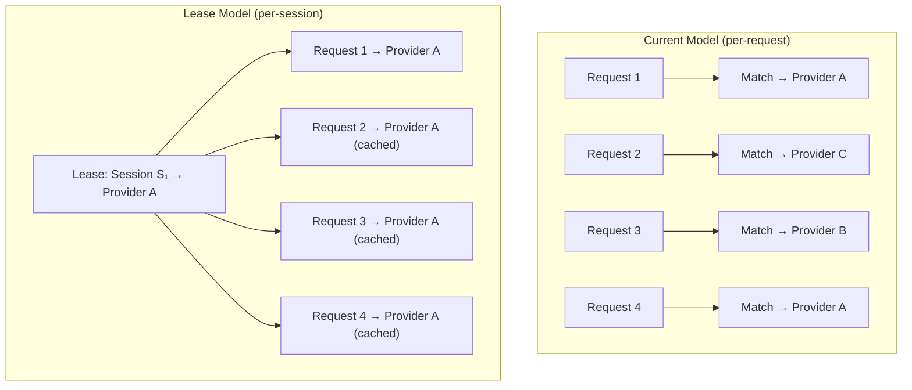
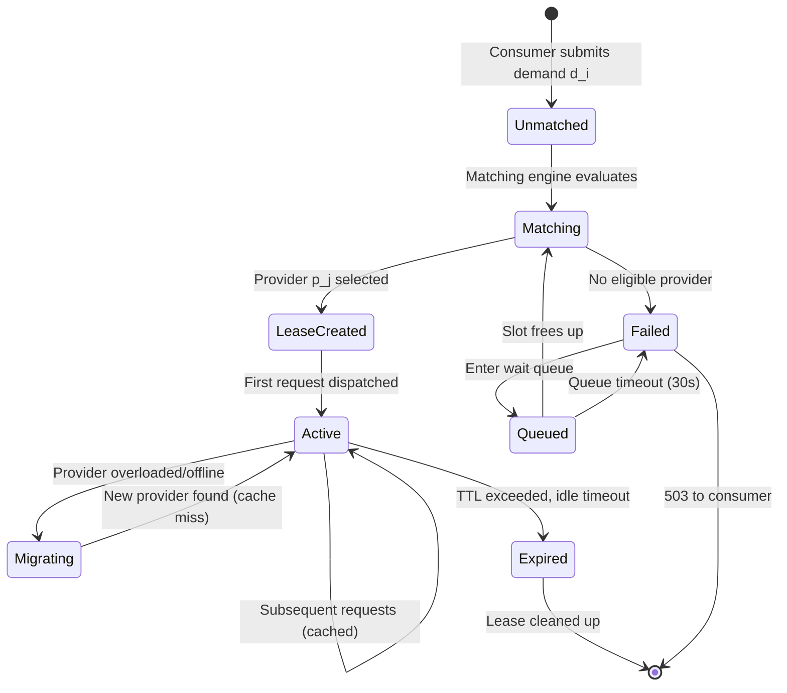
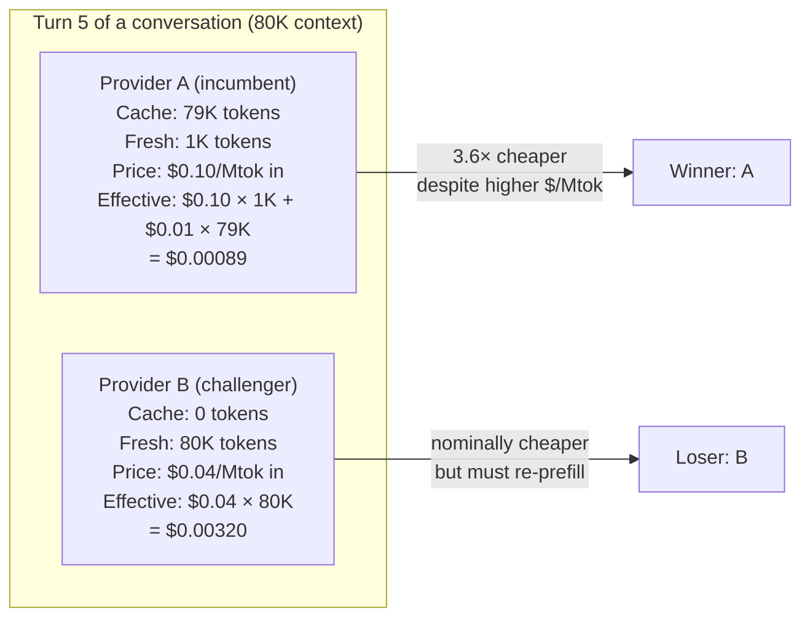
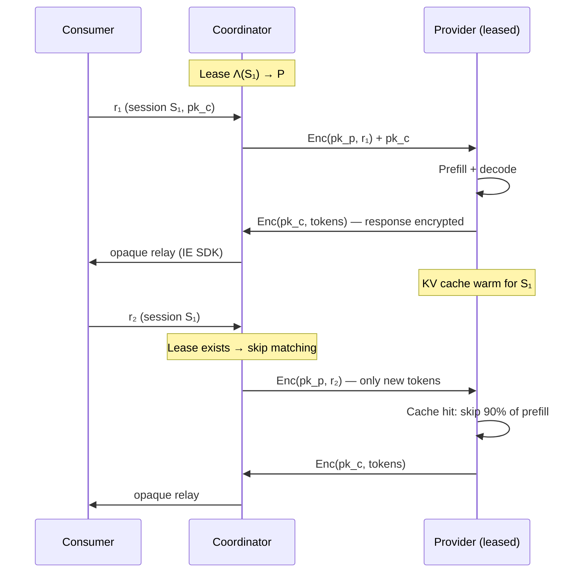
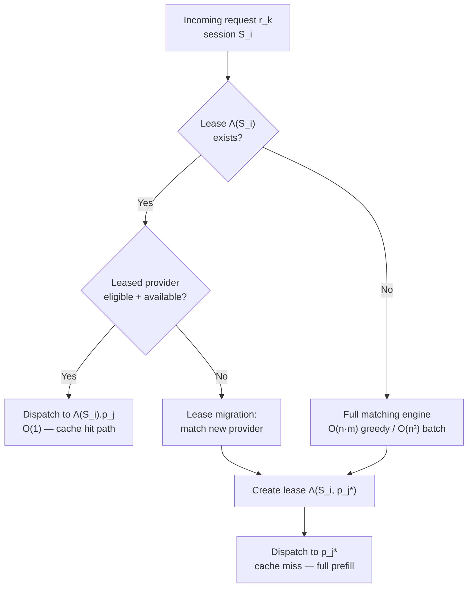
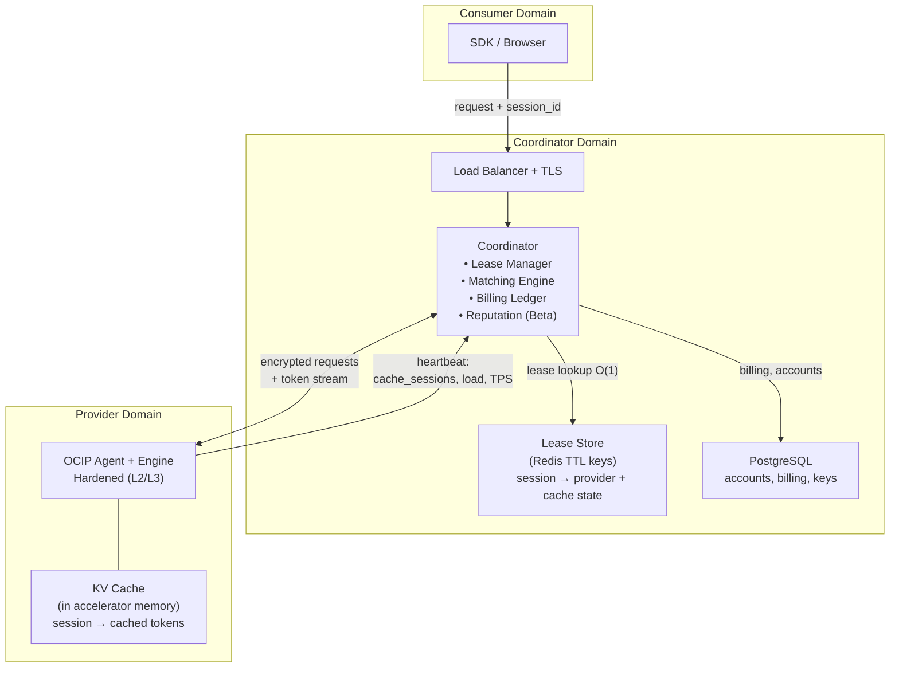

# Formal Model — Inference Exchange from First Principles

A mathematical specification of decentralized confidential inference.
Every design choice derives from physical constraints, information theory,
and mechanism design. Code is the implementation of these proofs.

---

## 0. Foundational Axioms

We begin with physical reality, not software architecture.

**Axiom 0 (Speed of Light).** Information propagation between two points
separated by distance $d$ has a minimum latency of $\tau_{\min} = d / c$,
where $c \approx 3 \times 10^8 \text{ m/s}$. In fiber optic, the effective
propagation speed is $c_f \approx 2 \times 10^8 \text{ m/s}$. No protocol
optimization can beat this.

**Axiom 1 (Conservation of Compute).** Generating $n$ tokens from an
autoregressive model of parameter count $P$ with precision $b$ bits requires
at minimum $\Omega(n \cdot P \cdot b)$ memory transfers and $\Omega(n \cdot P)$
floating-point operations. No caching, batching, or speculative strategy
eliminates this lower bound for the decode phase.

**Axiom 2 (Irreducibility of Secrets).** A cryptographic key of $k$ bits
requires $\Omega(2^{k/2})$ operations to break by exhaustive search
(birthday bound). An adversary with bounded computational resources
$C_{\text{adv}}$ cannot distinguish encrypted content from random if the
cipher is IND-CPA secure and $k$ is chosen such that $2^{k/2} \gg C_{\text{adv}}$.

**Axiom 3 (Hardware Root of Trust).** A hardware co-processor that generates
and stores a private key $\text{sk}$ such that no software-accessible bus
exports $\text{sk}$ provides a *trust anchor*. The binding between a physical
device and a public key $\text{pk}$ is verifiable only if the manufacturer
signs a certificate chain $\text{Cert}(\text{pk}, \text{device\_id})$.

**Axiom 4 (Impossibility of Trusted Third Parties).** Any centralized
coordinator $\mathcal{C}$ that can observe plaintext represents a single
point of compromise. Security claims that depend on the honest behavior of
$\mathcal{C}$ are operational assumptions, not cryptographic guarantees.

**Axiom 5 (State Locality).** The KV cache produced during prefill of $n$
input tokens occupies $O(n \cdot d \cdot L)$ bytes of accelerator memory
(where $d$ = hidden dimension, $L$ = layer count). Transferring this state
between machines costs $O(n \cdot d \cdot L / B_{\text{net}})$ seconds over
a network of bandwidth $B_{\text{net}}$. For large contexts this transfer
time exceeds recomputation time, making state *non-portable* in practice.
Therefore, KV cache state is economically bound to the machine that
computed it.

---

## 1. The Three Primitives

The fundamental insight: a conversation, an inference request, and a
market order are three distinct concepts that the current system conflates.

### Definition 1 (Inference Request)

A single invocation of an autoregressive model. Receives input tokens,
produces output tokens. Stateless from the caller's perspective.

$$r = (m, \mathbf{x}_{\text{in}}, n_{\text{max}}, \theta)$$

where $m$ is the model, $\mathbf{x}_{\text{in}}$ is the input token sequence,
$n_{\text{max}}$ is the output cap, and $\theta$ is the temperature/sampling config.

### Definition 2 (Session)

An ordered sequence of inference requests sharing conversational context.

$$S = (r_1, r_2, \ldots, r_K)$$

where each $r_k$ includes the accumulated context:

$$\mathbf{x}_{\text{in}}^{(k)} = [\text{system}] \| [\text{turn}_1] \| \cdots \| [\text{turn}_{k-1}] \| [\text{new}_k]$$

The session is the *logical* unit of a conversation. It spans multiple
inference requests.

### Definition 3 (Lease)

A time-bounded reservation of compute capacity on a specific provider
for a specific session. The lease is the *tradeable* unit of the exchange.

$$\Lambda = (S, p_j, m, \ell, \pi, K_{\text{cache}}, \Delta t, \text{SLA})$$

where:
- $S$: session identifier
- $p_j$: the assigned provider
- $m$: the model
- $\ell$: the trust level floor
- $\pi = (\pi^{\text{in}}, \pi^{\text{out}}, \pi^{\text{cache}})$: the three-rate price vector
- $K_{\text{cache}}$: the cache state held by this provider for this session
- $\Delta t$: lease duration (TTL)
- $\text{SLA}$: latency/throughput guarantees



**Theorem 1 (Lease Necessity).** Per-request matching destroys cache
locality. By Axiom 5, KV cache state is bound to the machine that computed
it. For a $K$-turn session, per-request matching has expected cache hit
rate $1/m$ (where $m$ = eligible providers), yielding expected input cost:

$$\mathbb{E}[C_{\text{per-request}}] = \pi^{\text{in}} \cdot \sum_{k=1}^{K} \left(\frac{1}{m} \cdot n_{\text{new}}^{(k)} + \frac{m-1}{m} \cdot n_{\text{in}}^{(k)}\right)$$

Under a lease (same provider), the expected input cost is:

$$C_{\text{lease}} = \pi^{\text{in}} \cdot n_{\text{in}}^{(1)} + \pi^{\text{cache}} \cdot \sum_{k=2}^{K} n_{\text{cached}}^{(k)} + \pi^{\text{in}} \cdot \sum_{k=2}^{K} n_{\text{new}}^{(k)}$$

For $m > 1$ and $K > 1$, the lease cost is strictly lower. The savings
grow quadratically with conversation length (Theorem 5 below).

---

## 2. System Model

### 2.1 Participants

$$\mathcal{S} = \mathcal{C}\text{onsumers} \cup \mathcal{P}\text{roviders} \cup \{\mathcal{X}\}$$

- A **consumer** $c_i \in \mathcal{C}$ holds keypair $(sk_i^c, pk_i^c)$,
  submits **session demands**.
- A **provider** $p_j \in \mathcal{P}$ holds keypair $(sk_j^p, pk_j^p)$,
  publishes **capacity offers**.
- The **coordinator** $\mathcal{X}$ matches demands to offers, manages
  leases, meters usage, and relays encrypted traffic.

### 2.2 Provider Capacity (the Offer)

A provider doesn't sell "$/Mtok." A provider sells a **capacity function**:

$$a_j = (p_j,\; M_j,\; \ell_j,\; \pi_j,\; T_j^{\text{decode}},\; T_j^{\text{prefill}},\; s_j,\; K_j^{\text{cache}},\; \sigma_j,\; \text{hw}_j)$$

where:
- $M_j \subseteq \mathcal{M}$: set of loaded models
- $\ell_j \in \mathcal{L}$: trust level (determined by hardware + hardening)
- $\pi_j = (\pi_j^{\text{in}}, \pi_j^{\text{out}}, \pi_j^{\text{cache}})$: three-rate price vector
- $T_j^{\text{decode}}$: decode throughput (tok/s, bounded by memory bandwidth)
- $T_j^{\text{prefill}}$: prefill throughput (tok/s, bounded by FLOPS)
- $s_j = (s_j^{\text{free}}, s_j^{\text{total}})$: compute slots
- $K_j^{\text{cache}} = \{(S_k, n_k, t_k^{\text{last}})\}$: set of active cache entries
  (session ID, cached token count, last access time)
- $\sigma_j \in [0,1]$: reputation (Beta posterior lower bound)
- $\text{hw}_j$: hardware descriptor (chip, bandwidth, FLOPS, memory)

The provider reports $K_j^{\text{cache}}$ in each heartbeat. This is
the critical new data: the coordinator knows *which sessions have warm
cache on which providers*.

### 2.3 Consumer Demand (the Order)

A consumer demand is richer than a single request:

$$d_i = (c_i,\; m_i,\; \ell_i^{\min},\; \pi_i^{\max},\; \rho_i,\; S_i,\; \text{continuity}_i)$$

where the new fields are:
- $S_i$: session identifier (groups requests for cache affinity)
- $\text{continuity}_i \in \{\text{prefer}, \text{require}, \text{none}\}$:
  how strongly the consumer wants the same provider

| Continuity | Meaning | Cache Behavior |
|---|---|---|
| `none` | Don't care about provider stability | Per-request matching (current behavior) |
| `prefer` | Same provider if available and competitive | Lease with soft affinity (default) |
| `require` | Same provider or fail | Strict lease (consumer accepts availability risk) |

### 2.4 Trust Levels as Adversary Capability Sets

Define $\mathcal{L} = \{L_0, L_1, L_2, L_3\}$ with total ordering
$L_0 < L_1 < L_2 < L_3$.

| Level | Adversary Capabilities |
|---|---|
| $L_0$ | $\{\text{read\_mem}, \text{attach\_dbg}, \text{inject\_code}, \text{replace\_bin}\}$ |
| $L_1$ | $\text{Adv}_{L_0} \setminus \{\text{read\_network}\}$ (transport encrypted) |
| $L_2$ | $\{\text{kill\_proc}, \text{observe\_resource\_usage}\}$ (process hardened) |
| $L_3$ | $\{\text{power\_off}, \text{DoS}\}$ (hardware TEE) |

**Theorem 2 (Monotonicity of Privacy).** Higher trust strictly reduces
the eligible set: $\ell' > \ell \implies \mathcal{P}_{\ell'} \subseteq \mathcal{P}_{\ell}$.
Privacy costs availability.

---

## 3. The Lease Lifecycle



### 3.1 Lease Creation (the Match)

When a demand $d_i$ with $S_i \neq \emptyset$ arrives:

1. **Check existing lease:** If $\Lambda(S_i)$ exists and the assigned
   provider is still eligible:
   - Dispatch directly to $\Lambda(S_i).p_j$ (cache hit path)
   - Skip matching entirely: $O(1)$

2. **No existing lease:** Run the matching engine:
   - Filter eligible providers: $E(d_i, a_j) = 1$
   - Score with cache awareness (§3.2)
   - Create lease: $\Lambda(S_i) = (S_i, p_j^*, \ldots)$

3. **Lease migration:** If the leased provider is offline or at capacity:
   - Find new provider (cache miss, full re-prefill)
   - Update lease: $\Lambda(S_i).p_j \leftarrow p_j^{\text{new}}$
   - Consumer experiences higher TTFT but session continues

### 3.2 Cache-Aware Scoring

The scoring function now accounts for the economic value of cache locality.

For eligible pair $(d_i, a_j)$:

$$\phi(d_i, a_j) = \phi_{\text{base}}(d_i, a_j) + w_c \cdot f_c(d_i, a_j)$$

where $\phi_{\text{base}}$ is the existing four-factor score and:

$$f_c(d_i, a_j) = \begin{cases}
\frac{n_{\text{cached}}(S_i, p_j)}{n_{\text{in}}^{(k)}} & \text{if } (S_i, \cdot) \in K_j^{\text{cache}} \\
0 & \text{otherwise}
\end{cases}$$

This is the **cache hit ratio** — the fraction of input tokens that
the provider already has in KV cache. It ranges from 0 (no cache) to
nearly 1 (almost everything cached).

The economic value of this cache hit:

$$V_{\text{cache}}(d_i, a_j) = n_{\text{cached}} \cdot (\pi_j^{\text{in}} - \pi_j^{\text{cache}}) + \frac{n_{\text{cached}}}{T_j^{\text{prefill}}} \cdot v_{\text{time}}$$

where $v_{\text{time}}$ is the consumer's implicit value of time (derived
from preference $\rho_i$). The first term is the direct cost saving. The
second is the latency saving monetized.

**Theorem 3 (Cache Dominance).** For a session with $n_{\text{cached}} \gg n_{\text{new}}$
(long conversation, short new message), the cache-aware score can
override a nominally cheaper provider:

$$\phi(d_i, a_{\text{expensive+cached}}) > \phi(d_i, a_{\text{cheap+nocache}})$$

iff $w_c \cdot f_c > w_p \cdot (f_p(a_{\text{cheap}}) - f_p(a_{\text{expensive}}))$

In plain language: a provider with a warm 80K-token cache is worth more
than a nominally cheaper provider that must re-prefill 80K tokens from
scratch, even if the cached provider charges more per token.

**This is the central economic insight of the exchange.** Token price alone
is insufficient for routing. The matching engine must compute *effective
cost* including cache locality.

### 3.3 Effective Cost

The effective cost of request $r_k$ in session $S$ on provider $p_j$:

$$C_{\text{eff}}(r_k, p_j) = \underbrace{n_{\text{new}}^{(k)} \cdot \pi_j^{\text{in}}}_{\text{fresh input}} + \underbrace{n_{\text{cached}}^{(k)} \cdot \pi_j^{\text{cache}}}_{\text{cached input}} + \underbrace{n_{\text{out}}^{(k)} \cdot \pi_j^{\text{out}}}_{\text{output}}$$

Versus migration to a new provider $p_{j'}$ (no cache):

$$C_{\text{migrate}}(r_k, p_{j'}) = \underbrace{n_{\text{in}}^{(k)} \cdot \pi_{j'}^{\text{in}}}_{\text{full re-prefill}} + \underbrace{n_{\text{out}}^{(k)} \cdot \pi_{j'}^{\text{out}}}_{\text{output}} + \underbrace{\frac{n_{\text{in}}^{(k)} - n_{\text{new}}^{(k)}}{T_{j'}^{\text{prefill}}} \cdot v_{\text{time}}}_{\text{latency cost of lost cache}}$$

The matching engine should prefer staying on $p_j$ (lease renewal) when:

$$C_{\text{eff}}(r_k, p_j) < C_{\text{migrate}}(r_k, p_{j'}) \quad \forall p_{j'} \neq p_j$$



---

## 4. The Three-Rate Billing Model

### 4.1 Price Vector

Each provider advertises a three-rate price vector:

$$\pi_j = (\pi_j^{\text{in}}, \pi_j^{\text{out}}, \pi_j^{\text{cache}})$$

| Rate | What it covers | Physical cost driver |
|---|---|---|
| $\pi^{\text{in}}$ | Fresh input tokens (prefill) | Compute-bound: $O(n^2)$ attention FLOPS |
| $\pi^{\text{out}}$ | Output tokens (decode) | Bandwidth-bound: sequential memory reads |
| $\pi^{\text{cache}}$ | Cached input tokens (KV reuse) | Memory-bound: holding KV state in RAM |

**Constraint:** $\pi^{\text{cache}} \leq \pi^{\text{in}}$. The cache rate
should be strictly less than fresh input (the provider does less work).
Typical ratio: $\pi^{\text{cache}} \approx 0.1 \cdot \pi^{\text{in}}$
(90% discount, matching Anthropic's cache pricing).

### 4.2 Per-Request Billing Under a Lease

For request $r_k$ in session $S$ executed on leased provider $p_j$:

$$C(r_k) = n_{\text{fresh}}^{(k)} \cdot \pi_j^{\text{in}} + n_{\text{cached}}^{(k)} \cdot \pi_j^{\text{cache}} + n_{\text{out}}^{(k)} \cdot \pi_j^{\text{out}}$$

where $n_{\text{fresh}}^{(k)} + n_{\text{cached}}^{(k)} = n_{\text{in}}^{(k)}$.

**Conservation law:**

$$C(r_k) = C_{\text{provider}}(r_k) + C_{\text{platform}}(r_k)$$
$$C_{\text{provider}}(r_k) = (1 - \alpha) \cdot C(r_k)$$
$$C_{\text{platform}}(r_k) = \alpha \cdot C(r_k)$$

### 4.3 Cache Verification (TTFT Proof)

The provider reports $n_{\text{cached}}^{(k)}$, but can it lie?

From Axiom 1, prefilling $n$ tokens requires at minimum
$n / T_j^{\text{prefill}}$ seconds. The coordinator measures
TTFT for every request. Define:

$$\text{TTFT}_{\text{expected}}^{\text{no-cache}} = \frac{n_{\text{in}}^{(k)}}{T_j^{\text{prefill}}} + \tau_{\text{net}} + \tau_{\text{first\_decode}}$$

$$\text{TTFT}_{\text{expected}}^{\text{cached}} = \frac{n_{\text{fresh}}^{(k)}}{T_j^{\text{prefill}}} + \tau_{\text{net}} + \tau_{\text{first\_decode}}$$

**Theorem 4 (TTFT Cache Proof).** A provider claiming cache hit for
$n_{\text{cached}}$ tokens but actually re-prefilling them produces:

$$\text{TTFT}_{\text{observed}} \geq \frac{n_{\text{in}}^{(k)}}{T_j^{\text{prefill}}}$$

This is physically unfakeable (Axiom 1). The coordinator can detect
the discrepancy:

$$\text{If } \text{TTFT}_{\text{observed}} > 1.5 \cdot \text{TTFT}_{\text{expected}}^{\text{cached}} \implies \text{cache claim invalid}$$

The provider is then billed at $\pi^{\text{in}}$ for the allegedly cached
tokens, and their reputation takes a hit.

### 4.4 Session Cost (Summed Over Turns)

Total session cost across $K$ turns with a lease:

$$C(S) = \sum_{k=1}^{K} C(r_k) = \pi^{\text{in}} \cdot N_{\text{fresh}} + \pi^{\text{cache}} \cdot N_{\text{cached}} + \pi^{\text{out}} \cdot N_{\text{out}}$$

**Theorem 5 (Cache Savings — refined).** For a $K$-turn session with
constant new message size $\bar{n}$ and constant output size $\bar{o}$:

Without cache (per-request matching, different providers):

$$C_{\text{no-cache}} = \pi^{\text{in}} \cdot \frac{K(K+1)}{2} \bar{n} + \pi^{\text{out}} \cdot K\bar{o}$$

The input cost is $O(K^2)$ because each turn re-prefills the full context.

With lease (same provider, cache hits):

$$C_{\text{lease}} = \pi^{\text{in}} \cdot K\bar{n} + \pi^{\text{cache}} \cdot \frac{K(K-1)}{2}\bar{n} + \pi^{\text{out}} \cdot K\bar{o}$$

For $\pi^{\text{cache}} = 0.1 \cdot \pi^{\text{in}}$ and $K = 10$:

$$\frac{C_{\text{no-cache}}}{C_{\text{lease}}} = \frac{55}{10 + 0.1 \times 45} = \frac{55}{14.5} \approx 3.8\times$$

A 10-turn conversation is **3.8× cheaper** with a lease than without.

---

## 5. Cryptographic Protocol

### 5.1 Request Encryption (per Axiom 2)

Each request $r_k$ in session $S$ is encrypted to the leased provider:

1. Generate ephemeral $(e_k, E_k) \leftarrow \text{X25519.KeyGen}()$
2. $K_{kj} = \text{X25519}(e_k, pk_j^p)$
3. $C_k = \text{XSalsa20-Poly1305}(K_{kj}, N_k, \text{plaintext}_k)$
4. Discard $e_k$ (forward secrecy — Theorem 6 below)

**Theorem 6 (Forward Secrecy).** Compromise of $sk_j^p$ at $t_c > t_k$
does not reveal $\text{plaintext}_k$ because $e_k$ was discarded at $t_k$.

**Axiom 4 compliance:** Two modes:

| Mode | Who encrypts | Coordinator sees plaintext? |
|---|---|---|
| Standard SDK | Coordinator | Yes (transient, during encryption) |
| IE SDK | Consumer client | No (opaque relay) |

### 5.2 Response Encryption

In IE SDK mode, the provider encrypts each token to $pk_i^c$:

$$\text{token}_k^{\text{enc}} = \text{XSalsa20-Poly1305}(K_{ji}, N_k, \text{token}_k)$$

where $K_{ji} = \text{X25519}(sk_j^p, pk_i^c)$.

### 5.3 Lease-Scoped Key Derivation

Within a lease, the consumer's $pk_i^c$ is established once and reused
for all requests. The provider holds $K_{ji}$ in memory for the lease
duration. This avoids per-request key exchange overhead for the response
path while maintaining per-request forward secrecy on the request path
(fresh ephemeral per request).



---

## 6. The Matching Problem (Revised)

### 6.1 Two-Level Matching

The matching engine operates at two levels:

**Level 1: Session-to-Provider (Lease creation)**
- Triggered when a new session starts or an existing lease fails
- Bipartite matching: sessions × providers
- Considers cache state, price, latency, trust, reputation
- Creates a lease $\Lambda(S_i, p_j)$

**Level 2: Request-to-Lease (Dispatch)**
- Triggered on every request
- $O(1)$ lookup: does session $S_i$ have an active lease?
- If yes: dispatch directly (no matching needed)
- If no: fall through to Level 1



### 6.2 Eligibility (unchanged)

$$E(d_i, a_j) = \begin{cases} 1 & \text{if } (m_i = \ast \lor m_i \in M_j) \land \pi_j^{\text{out}} \leq \pi_i^{\max} \land \ell_j \geq \ell_i^{\min} \land s_j^{\text{free}} > 0 \\ 0 & \text{otherwise} \end{cases}$$

### 6.3 Scoring (extended with cache + latency)

$$\phi(d_i, a_j) = \left(\sum_{k} w_k^{\rho_i} \cdot f_k(d_i, a_j)\right) \cdot g(\sigma_j)$$

**Component scores** (six factors, up from four):

$$f_p(d_i, a_j) = \frac{1}{1 + C_{\text{eff}}(r_k, a_j) / C_{\text{ref}}} \quad \text{(effective cost, not nominal price)}$$

$$f_s(d_i, a_j) = \frac{1}{1 + \hat{\tau}_j(d_i) / \tau_{\text{ref}}} \quad \text{(estimated TTFT for this specific request)}$$

$$f_t(a_j) = \frac{\ell_j}{|\mathcal{L}| - 1} \quad \text{(trust level)}$$

$$f_l(a_j) = 1 - \frac{s_j^{\text{used}}}{s_j^{\text{total}}} \quad \text{(load)}$$

$$f_c(d_i, a_j) = \frac{n_{\text{cached}}(S_i, p_j)}{n_{\text{in}}^{(k)}} \quad \text{(cache locality)}$$

$$f_r(a_j) = \hat{\sigma}_j \quad \text{(reputation: Beta posterior lower bound)}$$

**Weight vectors** (six-dimensional):

| $\rho$ | $w_p$ | $w_s$ | $w_t$ | $w_l$ | $w_c$ | $w_r$ |
|---|---|---|---|---|---|---|
| cheapest | 0.40 | 0.10 | 0.05 | 0.10 | 0.25 | 0.10 |
| fastest | 0.05 | 0.40 | 0.05 | 0.15 | 0.25 | 0.10 |
| secure | 0.05 | 0.05 | 0.45 | 0.10 | 0.15 | 0.20 |
| balanced | 0.20 | 0.15 | 0.15 | 0.10 | 0.25 | 0.15 |

Note: cache locality $w_c$ is significant in ALL preferences because the
economic benefit is real regardless of what the consumer optimizes for.

**Invariant:** $\sum_k w_k^{\rho} = 1$ for all $\rho$.

### 6.4 Reputation (Beta Posterior)

$$\sigma_j \sim \text{Beta}(1 + \text{successes}_j,\ 1 + \text{failures}_j)$$

Score using the 5th-percentile lower bound (Wilson score):

$$\hat{\sigma}_j = \text{Beta.ppf}(0.05, \alpha_j, \beta_j)$$

A new provider (1/1 success) gets $\hat{\sigma} \approx 0.05$.
A proven provider (999/1000) gets $\hat{\sigma} \approx 0.997$.

---

## 7. Latency Model

### 7.1 TTFT Decomposition

$$\text{TTFT} = \underbrace{\tau_{\text{net}}^{c \leftrightarrow x} + \tau_{\text{net}}^{x \leftrightarrow p}}_{\text{speed of light (Axiom 0)}} + \underbrace{\tau_{\text{match}}}_{\substack{O(1) \text{ if lease exists} \\ O(nm) \text{ otherwise}}} + \underbrace{\tau_{\text{crypto}}}_{\approx 0.1\text{ms}} + \underbrace{\tau_{\text{prefill}}(n_{\text{fresh}})}_{\text{Axiom 1: dominant term}} + \underbrace{\tau_{\text{1st decode}}}_{\approx 1/T_j^{\text{decode}}}$$

With a warm lease, $\tau_{\text{match}} \approx 0$ and
$n_{\text{fresh}} = n_{\text{new}}^{(k)} \ll n_{\text{in}}^{(k)}$, so
TTFT drops dramatically on subsequent turns.

### 7.2 Throughput Ceiling (Axiom 1)

$$T_j^{\text{decode}} \leq \frac{B_j}{2 P_m q / 8}$$

| Hardware | Bandwidth | 7B Q4 ceiling | 32B Q4 ceiling |
|---|---|---|---|
| M4 Pro | 250 GB/s | 31.7 tok/s | 6.9 tok/s |
| M4 Max | 500 GB/s | 63.5 tok/s | 13.9 tok/s |
| M2 Ultra | 800 GB/s | 101.6 tok/s | 22.2 tok/s |
| RTX 4090 | 1008 GB/s | 128.0 tok/s | 28.0 tok/s |

These are *physical limits*. Observed TPS above these values indicates
measurement error or speculative decoding.

---

## 8. Architecture (Derived)



### 8.1 What the Coordinator Stores Per Lease

```
Lease {
    session_id:     string          // consumer's session
    provider_id:    string          // assigned provider
    model:          string          // locked model
    trust_level:    L0-L3           // floor
    price_vector:   (in, out, cache) // locked at creation
    cached_tokens:  int             // last reported by provider
    created_at:     timestamp
    last_request:   timestamp
    ttl:            duration        // lease expires if idle
    consumer_pk:    string          // for response encryption
}
```

TTL is governed by: `min(provider_cache_timeout, lease_max_duration, idle_timeout)`.
When the lease expires, the next request for this session triggers fresh matching.

---

## 9. Invariants

### Safety

**S1 (Billing Conservation):**
$\forall t: \sum_c \text{spent}(c,t) = \sum_p \text{earned}(p,t) + \text{fees}(t)$

**S2 (Eligibility Soundness):**
$\text{matched}(d_i, a_j) \implies E(d_i, a_j) = 1$

**S3 (Forward Secrecy):**
$\text{compromise}(sk_j^p, t_c) \not\Rightarrow \text{learn}(\text{plaintext}_k)$ for $t_k < t_c$

**S4 (Key Isolation):**
$sk_j^p \notin \text{memory}(\mathcal{X})$

**S5 (Capacity Bound):**
$|\text{active\_requests}(p_j)| \leq s_j^{\text{total}}$

**S6 (Lease Exclusivity):**
Each session has at most one active lease:
$|\{\Lambda : \Lambda.S = S_i \land \text{active}(\Lambda)\}| \leq 1$

**S7 (Cache Consistency):**
Billing uses the provider-reported cache count only when validated by TTFT:
$\text{bill\_as\_cached}(n) \implies \text{TTFT}_{\text{obs}} \leq 1.5 \cdot \text{TTFT}_{\text{expected}}^{\text{cached}}(n)$

### Liveness

**L1 (Progress):** Requests with eligible providers match within
$\max(\tau_{\text{match}}, \delta_{\text{batch}})$.

**L2 (Timeout):** All requests resolve within $\delta$.

**L3 (Lease Expiry):** Idle leases expire within TTL. No resource leak.

**L4 (Migration Liveness):** If a leased provider disconnects, the lease
migrates within one heartbeat interval ($\leq 2 \times \text{heartbeat}$).

### Fairness

**F1 (FIFO):** Within identical constraints, earlier orders match first.

**F2 (No Starvation):** Most-constrained-first heuristic in batch mode.

---

## 10. Current Code vs. Formal Model

| Formal Concept | Current Implementation | Gap |
|---|---|---|
| Three primitives (request, session, lease) | Only requests; no session or lease abstraction | **Major:** Must add lease manager |
| Three-rate pricing $(\pi^{\text{in}}, \pi^{\text{out}}, \pi^{\text{cache}})$ | Two-rate $(\pi^{\text{in}}, \pi^{\text{out}})$ | Must add cache rate |
| Cache-aware scoring $f_c$ | Session affinity bonus (flat 20%) | Must replace with cache-ratio scoring |
| Effective cost $C_{\text{eff}}$ | Nominal price only | Must compute effective cost including cache |
| Lease lifecycle | None — per-request matching only | **Major:** Must add lease state machine |
| TTFT-based cache verification | Not implemented | Must measure TTFT and cross-validate |
| Beta reputation | EMA ($\alpha = 0.1$) | Must replace with Beta posterior |
| Provider heartbeat with cache state | Heartbeat has `active_requests`, `loaded_models` | Must add `cache_sessions` |
| Latency-aware scoring $f_s$ | Decode TPS only | Must add prefill + network RTT |
| `ocip_min_confidence` default | `"hardened"` (just fixed) | ✅ Aligned |
| Forward secrecy | Ephemeral X25519 per request | ✅ Holds |
| Key isolation | Provider key never leaves provider | ✅ Holds |
| Billing conservation | Property-based tested | ✅ Verified |
| Consumer `session_id` in Chat UI | Not wired | Must add to Chat page requests |

### Implementation Priority

1. **Lease Manager** — The highest-impact change. Adds session-to-provider
   binding with TTL, cache tracking, and $O(1)$ dispatch for leased sessions.
   Every subsequent improvement depends on this.

2. **Provider heartbeat: cache state** — Providers report which sessions
   they have cached and how many tokens. Without this, the coordinator
   can't do cache-aware scoring.

3. **Three-rate billing** — Add $\pi^{\text{cache}}$ to provider offers
   and billing. This is the user-facing economic benefit of leases.

4. **Cache-aware scoring** — Replace the flat 20% affinity bonus with
   the economic cache-value function $f_c$.

5. **TTFT measurement + cache verification** — Coordinator measures TTFT
   per request and cross-validates provider cache claims.

6. **Beta reputation** — Replace EMA with Beta posterior. Independent of
   the lease work but improves scoring quality.

7. **Session ID in Chat UI** — Wire `ocip_session_id` through the full
   stack so leases can actually be created from the web interface.
