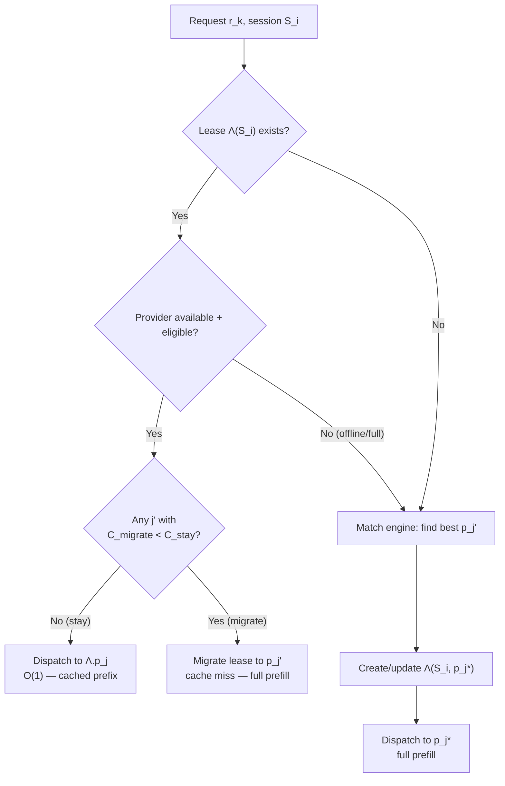

# Formal Model — Inference Exchange from First Principles

A mathematical specification of a market for stateful model-execution
capacity. Tokens are the metering unit; the scarce assets are compute
slots, KV state, model residency, latency, and trust.

Every statement is categorized as one of:
- **Axiom**: physical or mathematical fact we assume without proof
- **Definition**: a term we define for use in the model
- **Proposition**: a statement derivable from the axioms and definitions
- **Economic convention**: an accounting rule we choose (could be different)
- **Mechanism choice**: a market-design decision (alternatives exist)

---

## 0. Physical Assumptions

**Axiom 0 (Propagation Bound).** Information between points separated by
distance $d$ over fiber has minimum one-way latency $\tau_{\min} = d / c_f$
where $c_f \approx 2 \times 10^8$ m/s.

**Axiom 1 (Compute Lower Bound).** Generating $n$ tokens from an autoregressive
model of $P$ parameters at $b$-bit precision requires at minimum:
- Decode (sequential): $\Omega(n \cdot P \cdot b / 8)$ bytes of memory transfer
- Prefill (parallel): $\Omega(n_{\text{in}}^2 \cdot d_h)$ FLOPS for self-attention
  over $n_{\text{in}}$ input tokens with hidden dimension $d_h$

No software optimization eliminates these lower bounds.

**Axiom 2 (Computational Hardness of Key Recovery).** For a symmetric cipher
with $k$-bit keys, generic brute-force search requires $O(2^k)$ operations.
For collision resistance of a hash with $k$-bit output, the birthday bound
gives $O(2^{k/2})$ operations. X25519 ECDH security rests on the hardness
of the Computational Diffie-Hellman (CDH) problem on Curve25519, estimated
at ~128-bit security.

**Axiom 3 (Hardware Root of Trust).** A hardware co-processor that generates
and stores a private key $\text{sk}$ such that no software-accessible bus
exports $\text{sk}$ provides a *trust anchor*. The binding between a physical
device and a public key $\text{pk}$ is verifiable only if the manufacturer
signs a certificate chain $\text{Cert}(\text{pk}, \text{device\_id})$.

**Axiom 4 (Impossibility of Trusted Third Parties).** Any centralized
coordinator that can observe plaintext represents a single point of
compromise. Security claims depending on honest coordinator behavior are
operational assumptions, not cryptographic guarantees.

**Axiom 5 (State Locality).** The KV cache produced during prefill of
$n$ tokens occupies $O(n \cdot d_h \cdot L)$ bytes (hidden dim × layers).
Transferring this between machines costs $O(n \cdot d_h \cdot L / B_{\text{net}})$
seconds. For large contexts on typical networks, transfer time exceeds
recomputation time.

**Consequence of Axiom 5:** KV cache state is economically bound to the
machine that computed it. This is the physical basis for session affinity.

---

## 1. Definitions

### 1.1 The Three Primitives

**Definition 1 (Inference Request).** A single invocation of an autoregressive
model:

$$r = (m, \mathbf{x}_{\text{in}}, n_{\text{max}}, \theta)$$

where $m$ is the model, $\mathbf{x}_{\text{in}}$ is the input token sequence,
$n_{\text{max}}$ is the output cap, $\theta$ is sampling configuration.

**Definition 2 (Session).** An ordered sequence of inference requests sharing
conversational context:

$$S = (r_1, r_2, \ldots, r_K)$$

where request $r_k$ includes accumulated context:

$$\mathbf{x}_{\text{in}}^{(k)} = \text{sys} \| \text{turn}_1 \| \cdots \| \text{turn}_{k-1} \| \text{new}_k$$

**Definition 3 (Stateful Execution Lease).** A time-bounded reservation of:

$$\Lambda = (S,\; p_j,\; m,\; \ell,\; \pi,\; \Delta t)$$

The lease binds a session to a specific provider. The valuable thing being
reserved is not just compute capacity, but the composite:

$$\boxed{\text{compute slots} + \text{model residency} + \text{KV state} + \text{network locality} + \text{trust environment}}$$

**Definition 4 (Cached Prefix).** The longest common prefix between the
session's current context and the provider's KV cache:

$$P(S, p_j) = \text{longest common prefix}(\mathbf{x}_{\text{in}}^{(k)},\; \text{cache}(p_j, S))$$

Then:

$$n_{\text{cached}} = |P(S, p_j)|, \qquad n_{\text{fresh}} = n_{\text{in}}^{(k)} - |P(S, p_j)|$$

This is the economically relevant quantity — not "how many tokens are cached"
but "how many tokens of *this specific prefix* are cached."

### 1.2 Participants

$$\mathcal{S} = \mathcal{C}\text{onsumers} \cup \mathcal{P}\text{roviders} \cup \{\mathcal{X}\}$$

A **consumer** $c_i$ holds keypair $(sk_i^c, pk_i^c)$, submits session demands.
A **provider** $p_j$ holds keypair $(sk_j^p, pk_j^p)$, publishes capacity offers.
The **coordinator** $\mathcal{X}$ matches demands to offers, manages leases,
meters usage, relays encrypted traffic.

### 1.3 Trust Levels

**Definition 5.** $\mathcal{L} = \{L_0, L_1, L_2, L_3\}$ with total ordering
$L_0 < L_1 < L_2 < L_3$.

| Level | Adversary Capabilities (provider operator) |
|---|---|
| $L_0$ | $\{\text{read\_mem}, \text{attach\_dbg}, \text{inject\_code}, \text{replace\_bin}\}$ |
| $L_1$ | $\text{Adv}_{L_0} \setminus \{\text{read\_network}\}$ |
| $L_2$ | $\{\text{kill\_proc}, \text{observe\_resource\_usage}\}$ |
| $L_3$ | $\{\text{power\_off}, \text{DoS}\}$ |

**Proposition 1 (Monotonicity of Privacy).** $\ell' > \ell \implies \mathcal{P}_{\ell'} \subseteq \mathcal{P}_{\ell}$.
Higher trust strictly reduces the eligible provider set.

*Proof:* Follows directly from the total ordering and the eligibility
predicate requiring $\ell_j \geq \ell_{\min}$. $\square$

**Consequence:** Privacy costs availability. This is the fundamental tradeoff.

---

## 2. Provider Supply

### 2.1 Capacity Offer

A provider publishes:

$$a_j = (p_j,\; M_j,\; \ell_j,\; \pi_j,\; T_j,\; s_j,\; K_j,\; \sigma_j,\; \text{hw}_j)$$

where:
- $M_j$: loaded models
- $\ell_j$: trust level
- $\pi_j = (\pi_j^{\text{prefill}}, \pi_j^{\text{decode}}, \pi_j^{\text{cache}}, \pi_j^{\text{reservation}})$: four-rate price vector
- $T_j = (T_j^{\text{decode}}, T_j^{\text{prefill}})$: throughput
- $s_j = (s_j^{\text{free}}, s_j^{\text{total}})$: slots
- $K_j = \{(S_k, m_k, n_k, t_k^{\text{last}}, t_k^{\text{expiry}}, h_k^{\text{prefix}})\}$: cache entries
- $\sigma_j$: reputation
- $\text{hw}_j$: hardware descriptor

### 2.2 The Four Rates

| Rate | What it covers | Physical cost driver |
|---|---|---|
| $\pi^{\text{prefill}}$ | Fresh input tokens | Compute: $O(n^2)$ attention |
| $\pi^{\text{decode}}$ | Output tokens | Memory bandwidth: sequential reads |
| $\pi^{\text{cache}}$ | Cached prefix tokens | Memory occupancy: holding KV state |
| $\pi^{\text{reservation}}$ | Holding a slot idle | Opportunity cost of blocked capacity |

**Economic convention:** $\pi^{\text{cache}} \leq \pi^{\text{prefill}}$.
The provider should charge less for cached tokens because they do less work.
But this is a market convention, not a physical law — providers set their
own rates.

**Mechanism choice:** The reservation rate $\pi^{\text{reservation}}$ allows
providers to charge for holding scarce capacity even when idle. This is
important on small Apple Silicon machines where a single slot reservation
blocks 100% of capacity.

### 2.3 Supply Curves (future evolution)

**Mechanism choice:** Eventually, providers should submit a supply curve
rather than a flat price:

| Active sessions | Price |
|---|---|
| 1 | $0.10/Mtok |
| 2 | $0.13/Mtok |
| 3 | $0.21/Mtok |

This reflects the real opportunity cost: the marginal session on a
2-slot machine imposes congestion externalities on existing sessions
(lower throughput, higher latency). A supply curve makes the market
economically efficient. For the MVP, flat pricing is sufficient.

### 2.4 Throughput Ceilings

**Proposition 2 (Decode Bound).** From Axiom 1:

$$T_j^{\text{decode}} \leq \frac{B_j}{2 P_m b / 8}$$

where $B_j$ = memory bandwidth, $P_m$ = model parameters, $b$ = quantization bits.

| Hardware | Bandwidth | 7B Q4 ceiling | 32B Q4 ceiling |
|---|---|---|---|
| M4 Pro | 250 GB/s | ~31.7 tok/s | ~6.9 tok/s |
| M4 Max | 500 GB/s | ~63.5 tok/s | ~13.9 tok/s |
| M2 Ultra | 800 GB/s | ~101.6 tok/s | ~22.2 tok/s |
| RTX 4090 | 1008 GB/s | ~128.0 tok/s | ~28.0 tok/s |

Observed TPS above these values indicates measurement error, speculative
decoding, or batching effects.

---

## 3. Consumer Demand

A consumer demand:

$$d_i = (c_i,\; m_i,\; \ell_i^{\min},\; \pi_i^{\max},\; \rho_i,\; S_i,\; \text{continuity}_i,\; L_i^{\max},\; T_i^{\min})$$

where:
- $m_i \in \mathcal{M} \cup \{\ast\}$: model ($\ast$ = any)
- $\ell_i^{\min}$: minimum trust level (**default: $L_2$**)
- $\pi_i^{\max}$: maximum price
- $\rho_i$: preference (cheapest, fastest, secure, balanced)
- $S_i$: session ID
- $\text{continuity}_i \in \{\text{prefer}, \text{require}, \text{none}\}$
- $L_i^{\max}$: max acceptable TTFT (latency constraint)
- $T_i^{\min}$: min acceptable decode throughput

---

## 4. Feasibility Constraints

**Definition 6 (Eligibility).** Provider $p_j$ is eligible for demand $d_i$ iff:

$$E(d_i, a_j) = \begin{cases} 1 & \text{if } (m_i = \ast \lor m_i \in M_j) \\ & \land\ \pi_j^{\text{decode}} \leq \pi_i^{\max} \\ & \land\ \ell_j \geq \ell_i^{\min} \\ & \land\ s_j^{\text{free}} > 0 \\ & \land\ T_j^{\text{decode}} \geq T_i^{\min} \\ 0 & \text{otherwise} \end{cases}$$

All predicates are $O(1)$ given precomputed model-set membership.

---

## 5. Cost Model

### 5.1 Per-Request Cost

**Economic convention.** The cost of request $r_k$ in session $S$ on provider $p_j$:

$$C(r_k, p_j) = n_{\text{fresh}}^{(k)} \cdot \pi_j^{\text{prefill}} + n_{\text{cached}}^{(k)} \cdot \pi_j^{\text{cache}} + n_{\text{out}}^{(k)} \cdot \pi_j^{\text{decode}}$$

where $n_{\text{fresh}} + n_{\text{cached}} = n_{\text{in}}$ and the
cached count is $|P(S, p_j)|$ — the length of the common prefix (Definition 4),
not an arbitrary number reported by the provider.

### 5.2 Platform Fee

**Economic convention.**

$$C_{\text{consumer}} = C(r_k, p_j), \quad C_{\text{provider}} = (1 - \alpha) \cdot C, \quad C_{\text{platform}} = \alpha \cdot C$$

where $\alpha = 0.10$.

**Invariant S1 (Conservation):** $C_{\text{consumer}} = C_{\text{provider}} + C_{\text{platform}}$.

### 5.3 Expected Total Cost (the objective function)

**Definition 7.** The expected economic cost of assigning demand $d_i$
to provider $p_j$ over the expected remaining session horizon $H$:

$$\boxed{E[C_{ij}] = C_{\text{tokens}} + C_{\text{latency}} + C_{\text{migration}} + C_{\text{failure}} + C_{\text{reservation}}}$$

where:

$$C_{\text{tokens}} = n_{\text{fresh}} \cdot \pi_j^{\text{prefill}} + n_{\text{cached}} \cdot \pi_j^{\text{cache}} + \hat{n}_{\text{out}} \cdot \pi_j^{\text{decode}}$$

$$C_{\text{latency}} = \lambda_i \cdot E[\text{TTFT}_j(d_i)]$$

where $\lambda_i$ is the consumer's implicit value-of-time (derived from $\rho_i$;
$\lambda = 0$ for cheapest, high for fastest).

$$C_{\text{migration}} = P(\text{provider fails during session}) \cdot V_{\text{lost-cache}}$$

where $V_{\text{lost-cache}} = n_{\text{cached}} \cdot (\pi^{\text{prefill}} - \pi^{\text{cache}}) + n_{\text{cached}} / T^{\text{prefill}} \cdot \lambda_i$
is the economic value of the cached prefix (re-prefill cost + re-prefill latency cost).

$$C_{\text{failure}} = P(\text{request failure}) \cdot C_{\text{retry}}$$

derived from reputation (§8).

$$C_{\text{reservation}} = \pi_j^{\text{reservation}} \cdot E[\text{idle time}]$$

### 5.4 Session Cost Over K Turns

**Proposition 3 (Quadratic Growth Without Cache).** For a $K$-turn session
with constant new-message size $\bar{n}$ and constant output $\bar{o}$,
total input tokens grow quadratically:

$$N_{\text{in}}^{\text{total}} = \sum_{k=1}^{K} n_{\text{in}}^{(k)} = \bar{n} \cdot \frac{K(K+1)}{2} + O(K)$$

*Proof:* $n_{\text{in}}^{(k)} = k\bar{n} + (k-1)\bar{o} + |\text{sys}|$.
Summing: $\sum k\bar{n} = \bar{n} K(K+1)/2$. $\square$

Without cache, every token is prefilled every turn:

$$C_{\text{no-cache}} = \pi^{\text{prefill}} \cdot \frac{K(K+1)}{2}\bar{n} + \pi^{\text{decode}} \cdot K\bar{o}$$

With a lease (same provider, all cache hits):

$$C_{\text{lease}} = \pi^{\text{prefill}} \cdot K\bar{n} + \pi^{\text{cache}} \cdot \frac{K(K-1)}{2}\bar{n} + \pi^{\text{decode}} \cdot K\bar{o}$$

**Proposition 4 (Lease Savings Condition).** The lease is cheaper iff:

$$\pi^{\text{cache}} < \pi^{\text{prefill}} \cdot \frac{K-1}{K-1} = \pi^{\text{prefill}}$$

Wait — that's always true by the convention $\pi^{\text{cache}} \leq \pi^{\text{prefill}}$.
More precisely, the savings are:

$$\Delta C = C_{\text{no-cache}} - C_{\text{lease}} = (\pi^{\text{prefill}} - \pi^{\text{cache}}) \cdot \frac{K(K-1)}{2}\bar{n}$$

This is positive iff $\pi^{\text{cache}} < \pi^{\text{prefill}}$, i.e., iff
the cache discount is nonzero. The savings grow as $O(K^2)$.

For $K = 10$, $\pi^{\text{cache}} = 0.1 \cdot \pi^{\text{prefill}}$:

$$\Delta C = 0.9 \cdot \pi^{\text{prefill}} \cdot 45\bar{n}$$

Versus total no-cache cost of $55 \cdot \pi^{\text{prefill}} \cdot \bar{n}$,
so the lease saves $\approx 73\%$ of input costs.

**Important caveat:** This assumes the lease provider's prices are the
same as the alternative's. If the leased provider charges significantly
more per token, the savings may be offset. The decision boundary is
where $C_{\text{lease}}(p_j) = C_{\text{no-cache}}(p_{j'})$.

---

## 6. The Session Assignment Problem

### 6.1 The Core Optimization

**Mechanism choice.** For demand $d_i$, select:

$$\boxed{j^* = \arg\min_j\; E[C_{ij}(S, H)]}$$

subject to $E(d_i, a_j) = 1$ (feasibility).

The preference $\rho_i$ determines the objective through $\lambda_i$:

| $\rho$ | Objective | $\lambda_i$ |
|---|---|---|
| cheapest | $\min E[C_{\text{tokens}}]$ | 0 |
| fastest | $\min E[C_{\text{tokens}}] + \lambda \cdot E[\text{TTFT}]$ | high |
| secure | $\min E[C_{\text{tokens}}]$ s.t. $\ell_j \geq L_3$ if possible | 0 |
| balanced | $\min E[C_{ij}]$ (full cost function) | moderate |

### 6.2 Stay vs. Migrate Decision

**Definition 8.** When a lease $\Lambda(S_i, p_j)$ exists and a new request
$r_k$ arrives, the coordinator evaluates:

$$\Delta C = E[C_{ij'}^{\text{migrate}}] - E[C_{ij}^{\text{stay}}]$$

for the best alternative $j' \neq j$.

$$\boxed{\text{Stay on } p_j \iff \Delta C > 0}$$

where:

$$E[C_{ij}^{\text{stay}}] = n_{\text{fresh}} \cdot \pi_j^{\text{prefill}} + n_{\text{cached}} \cdot \pi_j^{\text{cache}} + \hat{n}_{\text{out}} \cdot \pi_j^{\text{decode}} + \lambda_i \cdot \text{TTFT}_j^{\text{cached}}$$

$$E[C_{ij'}^{\text{migrate}}] = n_{\text{in}} \cdot \pi_{j'}^{\text{prefill}} + \hat{n}_{\text{out}} \cdot \pi_{j'}^{\text{decode}} + \lambda_i \cdot \text{TTFT}_{j'}^{\text{full}} + V_{\text{lost-cache}}$$

This gives a mathematically meaningful switching boundary. The incumbent
provider has an economic advantage from owning the cached state. A
challenger must overcome that advantage.

### 6.3 Batch Assignment

For multiple demands competing for scarce providers, solve:

$$\max_{\mu: D \to A \cup \{\bot\}} \sum_{d_i} -E[C_{i,\mu(i)}]$$

subject to capacity constraints $|\{d_i : \mu(d_i) = a_j\}| \leq s_j^{\text{free}}$.

This is bipartite matching with capacitated nodes:
- Greedy: $O(n \cdot m)$, optimal for $n = 1$
- Most-constrained-first: $O(n \cdot m \log n)$, near-optimal
- Hungarian: $O(n^3)$, globally optimal

**Proposition 5 (Greedy Suboptimality).** For $n > 1$ competing demands,
greedy matching can produce total cost up to $\frac{n-1}{n}$ worse than
optimal. This motivates the batch strategy when provider/demand ratio $\to 1$.

---

## 7. Latency Model

### 7.1 TTFT Decomposition

$$\text{TTFT} = \underbrace{2\tau_{\text{net}}}_{\text{Axiom 0}} + \underbrace{\tau_{\text{match}}}_{\substack{O(1) \text{ lease hit} \\ O(nm) \text{ fresh}}} + \underbrace{\tau_{\text{crypto}}}_{< 0.1\text{ms}} + \underbrace{\frac{n_{\text{fresh}}}{T_j^{\text{prefill}}}}_{\text{Axiom 1: dominant}} + \underbrace{\frac{1}{T_j^{\text{decode}}}}_{\text{first token}}$$

With a warm lease: $n_{\text{fresh}} \ll n_{\text{in}}$, so TTFT drops
dramatically on subsequent turns.

### 7.2 What Dominates

For $n_{\text{fresh}} > 200$ tokens: prefill dominates.
For $n_{\text{fresh}} < 50$ tokens: network RTT dominates (Axiom 0).
Crypto and matching are always negligible ($< 1$ms combined).

---

## 8. Reputation

### 8.1 Bayesian Model

**Mechanism choice.** Model provider success rate as:

$$\sigma_j \sim \text{Beta}(1 + s_j, 1 + f_j)$$

where $s_j$ = successes, $f_j$ = failures.

For scoring, use the 5th-percentile lower bound (Wilson score):

$$\hat{\sigma}_j = \text{Beta.ppf}(0.05,\; 1 + s_j,\; 1 + f_j)$$

| Provider | Record | $\hat{\sigma}$ | Interpretation |
|---|---|---|---|
| New (1/1) | 1 success | 0.05 | "Probably fine but we don't know" |
| Proven (999/1000) | 999 successes | 0.997 | "Very reliable" |
| Shaky (90/100) | 90 successes | 0.84 | "Usually OK, sometimes fails" |

### 8.2 Reputation in the Cost Function

$$C_{\text{failure}} = (1 - \hat{\sigma}_j) \cdot C_{\text{retry}}(d_i)$$

where $C_{\text{retry}}$ is the expected cost of re-matching and re-executing.

---

## 9. Cache Attestation

### 9.1 The Problem

The provider reports $n_{\text{cached}}$. Can it lie?

### 9.2 TTFT as Statistical Evidence (not proof)

From Axiom 1, prefilling $n$ tokens requires $\geq n / T_j^{\text{prefill}}$ seconds.
The coordinator measures TTFT. Define:

$$\text{TTFT}_{\text{expected}}^{\text{cached}} = \frac{n_{\text{fresh}}}{T_j^{\text{prefill}}} + \tau_{\text{net}} + \tau_{\text{overhead}}$$

$$\text{TTFT}_{\text{expected}}^{\text{no-cache}} = \frac{n_{\text{in}}}{T_j^{\text{prefill}}} + \tau_{\text{net}} + \tau_{\text{overhead}}$$

**TTFT is evidence, not proof.** TTFT is affected by queueing, batching,
scheduling contention, network jitter, thermal throttling, and speculative
decoding. A malicious provider can also report a plausible TTFT.

**Mechanism choice (Statistical Verification):** Model cache probability:

$$P(\text{cache hit} \mid \text{TTFT}, n_{\text{in}}, n_{\text{fresh}}, T_j, \text{load}_j)$$

using a Bayesian classifier trained on observed TTFT distributions.
If $P(\text{cache hit}) < \theta$ (e.g., 0.5), bill at $\pi^{\text{prefill}}$
instead of $\pi^{\text{cache}}$.

This is weaker than "physically unfakeable" but is the honest formulation.
For stronger guarantees, require cryptographic prefix commitments (future work).

---

## 10. Cryptographic Protocol

### 10.1 Request Encryption

**Current scheme:** Consumer sends plaintext to coordinator. Coordinator
generates ephemeral X25519 keypair, encrypts to provider's static key.

This provides **confidentiality from network observers** and
**coordinator cannot decrypt after encryption**. But:

**Important limitation:** This is NOT forward-secret against provider
key compromise. If an attacker later obtains $sk_j^p$ and recorded the
ephemeral public key $E_k$, they can compute $K = \text{X25519}(sk_j^p, E_k)$
and decrypt old traffic.

True forward secrecy requires ephemeral keys on BOTH sides, such as a
Noise NK or XX handshake pattern, or HPKE with ephemeral-ephemeral DH.

**IE SDK mode:** Consumer encrypts on their machine. Coordinator relays
opaque blob. This removes the coordinator from the trust boundary for
request confidentiality (Axiom 4).

### 10.2 Response Encryption

In IE SDK mode, provider encrypts each token to $pk_i^c$:

$$\text{token}_k^{\text{enc}} = \text{XSalsa20-Poly1305}(K_{ji}, N_k, \text{token}_k)$$

Within a lease, $K_{ji}$ is computed once and reused (session key),
avoiding per-token key exchange.

### 10.3 Honest Encryption Claims

| Mode | Request Confidentiality | Response Confidentiality | Forward Secret? |
|---|---|---|---|
| Standard SDK | Coordinator encrypts to provider | None (plaintext relay) | No (static provider key) |
| IE SDK | Consumer encrypts to provider | Provider encrypts to consumer | Requires ephemeral-ephemeral handshake |

The landing page claim "end-to-end encrypted" is true ONLY for IE SDK
mode, and even then forward secrecy requires a protocol upgrade.

### 10.4 Attestation Soundness

| Level | Verification | Assurance |
|---|---|---|
| $L_0$ | None | Self-declared |
| $L_1$ | Self-reported process isolation | Low (deterrent only) |
| $L_2$ | Binary hash + hardening flags, cross-validated by TPS anomaly | Medium (statistical) |
| $L_3$ | Hardware attestation signed by manufacturer CA (Axiom 3) | High (cryptographic) |

**Proposition 6 (Attestation Soundness at L3).** A provider cannot claim
$\ell_j = L_3$ without genuine TEE hardware, because the attestation report
is signed by a key embedded in hardware (Axiom 3) and verified against the
manufacturer's CA.

At $L_0$–$L_2$, attestation is a deterrent, not a cryptographic proof.

---

## 11. Invariants

### Safety

**S1 (Billing Conservation):**
$\forall t: \sum_c \text{spent}(c,t) = \sum_p \text{earned}(p,t) + \text{fees}(t)$

**S2 (Eligibility Soundness):**
$\text{matched}(d_i, a_j) \implies E(d_i, a_j) = 1$

**S3 (Key Isolation):**
$\forall j: sk_j^p \notin \text{memory}(\mathcal{X})$

**S4 (Capacity Bound):**
$|\text{active}(p_j)| \leq s_j^{\text{total}}$

**S5 (Lease Exclusivity):**
$|\{\Lambda : \Lambda.S = S_i \land \text{active}(\Lambda)\}| \leq 1$

**S6 (Cache Billing Consistency):**
Tokens billed at $\pi^{\text{cache}}$ only when the provider reports
a cached prefix AND TTFT evidence is consistent with cache hit.

### Liveness

**L1 (Progress):** Eligible demands match within $\max(\tau_{\text{match}}, \delta_{\text{batch}})$.

**L2 (Timeout):** All demands resolve within $\delta$.

**L3 (Lease Expiry):** Idle leases expire within TTL.

**L4 (Migration):** Leased provider disconnects → lease migrates within
$2 \times \text{heartbeat\_interval}$.

### Fairness

**F1 (FIFO):** Within identical constraints, earlier demands match first.

**F2 (No starvation):** Most-constrained-first in batch mode.

---

## 12. Current Code vs. Formal Model

| Formal Concept | Current Code | Status |
|---|---|---|
| Three primitives (request, session, lease) | Only requests | **Major gap** |
| Four-rate pricing | Two-rate ($\pi^{\text{in}}, \pi^{\text{out}}$) | Gap |
| Cached prefix $P(S, p_j)$ | Flat 20% affinity bonus | Gap |
| Expected cost objective $E[C_{ij}]$ | Weighted score heuristic | Gap |
| Stay-vs-migrate decision | Not implemented | Gap |
| Provider cache state in heartbeat | `active_requests`, `loaded_models` only | Gap |
| TTFT measurement + statistical verification | Not implemented | Gap |
| Beta reputation | EMA ($\alpha = 0.1$) | Gap |
| Forward secrecy | Not achieved (ephemeral-static, not ephemeral-ephemeral) | Gap |
| `ocip_min_confidence` default = $L_2$ | `"hardened"` | ✅ Fixed |
| Key isolation | Provider key never sent to coordinator | ✅ Holds |
| Billing conservation | Property-based tested | ✅ Verified |
| Capacity bound | `select_provider` checks slots | ✅ Holds |

### Implementation Priority

1. **Lease Manager** — session → provider binding with TTL, O(1) dispatch
2. **Provider heartbeat: cache prefix state** — which sessions, which prefix length
3. **Four-rate billing** — add $\pi^{\text{cache}}$ and $\pi^{\text{reservation}}$
4. **Cost-based matching** — replace heuristic scoring with $\min E[C_{ij}]$
5. **Stay-vs-migrate** — compare incumbent cost vs. challenger cost
6. **TTFT measurement** — statistical cache verification
7. **Beta reputation** — replace EMA
8. **Session ID in Chat UI** — wire through full stack
9. **Forward-secret protocol** — upgrade to Noise/HPKE ephemeral-ephemeral
