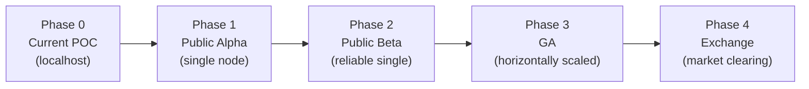
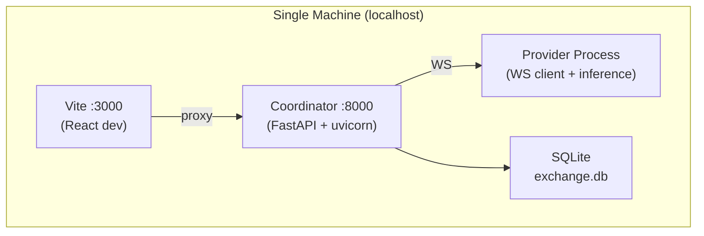
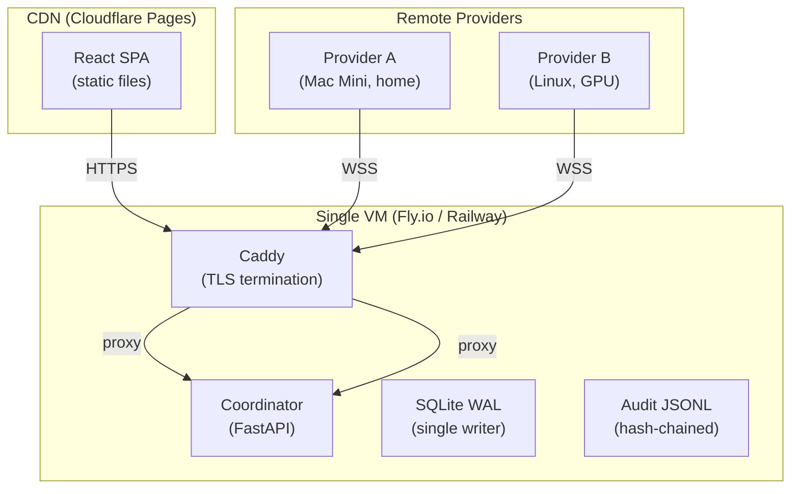
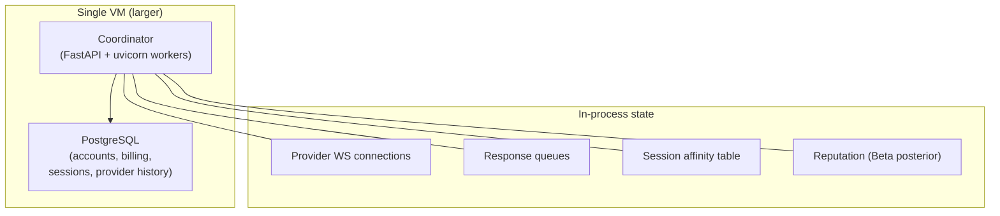
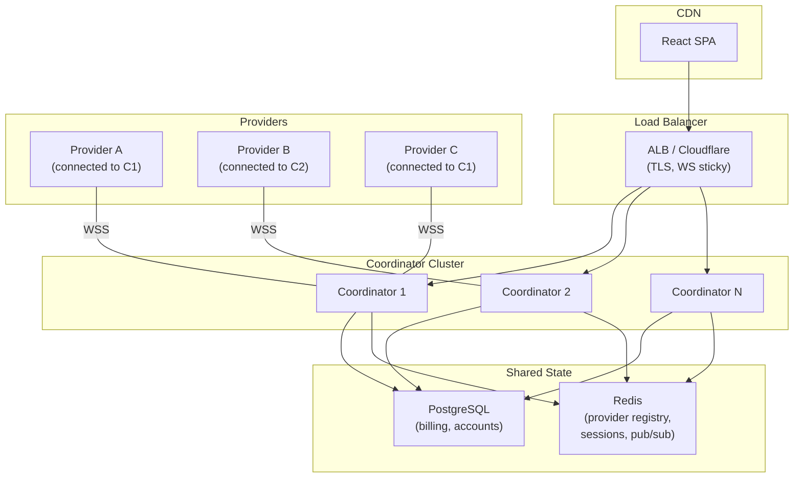
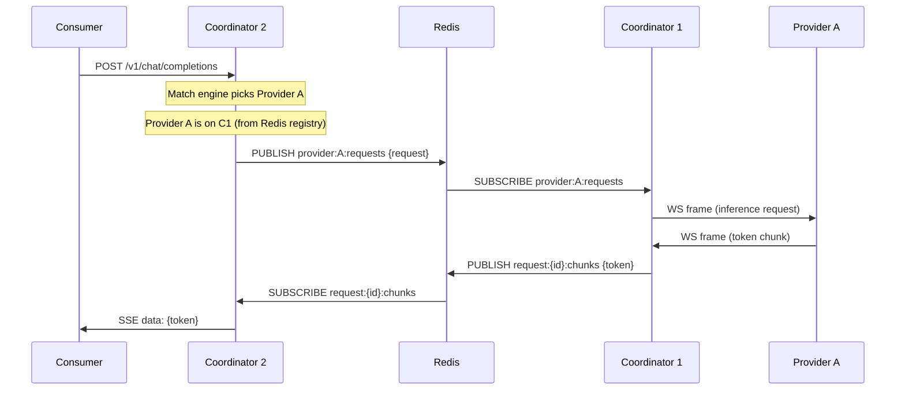
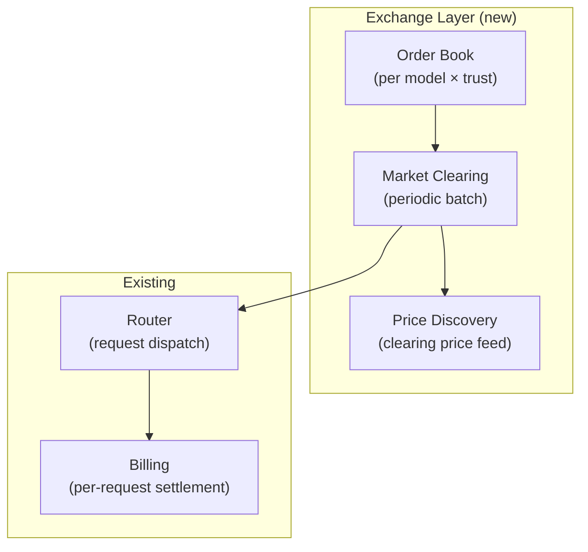

# Iterative System Design — From POC to Production

Derived from the formal model (v15). Each phase is a working product
that evolves toward the full architecture. Streaming, statefulness,
and distributed coordination are the hard engineering problems.

---

## The Hard Problems

The formal model describes a clean request → match → dispatch → bill
cycle. Reality adds complications that don't appear in the math:

**Streaming.** Inference produces tokens one at a time over seconds.
The coordinator must hold an SSE connection to the consumer AND a
WebSocket frame stream from the provider simultaneously, relay tokens
in real-time, and handle mid-stream failures (provider crash, consumer
disconnect, timeout). This is fundamentally a *distributed streaming
join* — two async streams that must be correlated by request ID.

**Statefulness.** Three kinds of state complicate horizontal scaling:
1. *Provider WebSocket connections* — a provider connects to ONE coordinator
   instance. Other instances can't send requests to that provider without
   cross-instance coordination.
2. *Response queues* — the asyncio Queue linking provider WS frames to
   consumer SSE lives in-process. If the coordinator restarts, in-flight
   requests die.
3. *Session affinity records* — which provider has KV cache for which
   session is coordinator-local state.

**Consistency under failures.** The billing ledger must be consistent
even when: providers disconnect mid-stream, consumers cancel, the
coordinator restarts, or multiple coordinator instances race on the
same provider slot.

---

## Phase Overview



| Phase | Users | Providers | Coordinator | DB | Streaming | State locality | Trust |
|---|---|---|---|---|---|---|---|
| 0 (POC) | 1 dev | 1-3 local | 1 process | SQLite | Works | None | Self-declared |
| 1 (Alpha) | ~50 testers | 3-10 remote | 1 VM | SQLite WAL | Works + TLS | Session ID tracked | Binary hash verified |
| 2 (Beta) | ~500 users | 10-50 | 1 VM (bigger) | PostgreSQL | Reconnect on failure | Stay-vs-switch routing | CI-built binaries |
| 3 (GA) | 5000+ | 50-200 | N instances | PostgreSQL + Redis | Cross-instance relay | Full Layer 2 | Notarized binaries |
| 4 (Exchange) | 10000+ | 200+ | N instances | PostgreSQL + Redis | Same as GA | Same as GA | L3 (hardware attest) |

---

## Phase 0: Current POC (what exists now)



**What works:** Single consumer → coordinator → single provider, streaming
SSE, basic matching, billing, E2E encryption (request side), Chat UI.

**What doesn't scale:** Everything is in-process. Provider WS connections,
response queues, session affinity, rate limit counters — all in Python
dicts. Single consumer at a time for streaming (asyncio). No TLS.

**Formal model coverage:** Layer 1 (stateless routing) partially. No
Layer 2 (state locality — session ID sent but not used for cost-based
routing). No Layer 3 (reservation). Two-rate billing (no cache/reservation
rates). EMA reputation (not Beta posterior).

---

## Phase 1: Public Alpha

**Goal:** Real users and remote providers over the internet. Still single
coordinator, but reliable enough for testing with ~50 users.

### Architecture



### Key changes from Phase 0

| Component | Phase 0 | Phase 1 |
|---|---|---|
| Transport | HTTP/WS | HTTPS/WSS (Caddy auto-TLS) |
| Frontend | Vite dev server | Static SPA on CDN |
| Provider auth | Optional | Required (provider tokens) |
| Consumer auth | Default API key | Email/password + API keys |
| Binary distribution | Build from source | CI-built agent + engine binaries |
| Attestation | Self-reported | Binary hash verified against CI manifest |
| Session tracking | Dict (session_id → provider_id) | Same, but coordinator persists to SQLite on graceful shutdown |
| Billing | In-memory + SQLite | SQLite WAL (survives restart) |
| Monitoring | Log files | Structured logging + health endpoint |

### Streaming architecture (unchanged from POC)

```
Consumer HTTP POST ──► Coordinator ──► Provider WS
     ▲                     │                │
     │                     │                │
     SSE stream ◄── asyncio.Queue ◄── WS frames
     (chunked)         (in-process)     (from provider)
```

This works for a single coordinator. The asyncio Queue is the
correlation point: `request_id → Queue → SSE generator`. The queue
lives in-process memory. If the coordinator restarts, in-flight
streams break — consumers get a connection reset and retry.

**Acceptable for alpha** because:
- ~50 concurrent users, single coordinator handles it
- Restart = seconds of downtime, not minutes
- Consumers retry automatically (SSE reconnect or client retry)

### What this phase validates

- Remote providers can connect over the internet reliably
- TLS works end-to-end
- CI-built binaries download and run on provider machines
- Binary hash attestation catches tampered binaries
- Multi-provider routing works with real heterogeneous hardware
- Billing is accurate across restarts
- L2 trust claims are backed by verified binary hashes

---

## Phase 2: Public Beta

**Goal:** Reliable enough for paying users. ~500 consumers, ~50 providers.
Still single coordinator but with proper persistence and failure handling.

### Architecture changes



### Key changes from Phase 1

| Component | Phase 1 | Phase 2 |
|---|---|---|
| Database | SQLite WAL | PostgreSQL (ACID, concurrent reads) |
| Reputation | EMA | Beta posterior (Wilson lower bound) |
| Session tracking | Session ID → provider ID | Session ID → provider ID + cache state |
| Routing | Greedy (min price) | Cost-based (min E[C_ij] from formal model) |
| Stay-vs-switch | Not implemented | Implemented (Layer 2 state locality) |
| Provider heartbeat | active_requests, loaded_models | + cache_sessions, prefix_lengths |
| TTFT measurement | Not measured | Coordinator timestamps first token |
| Error handling | Generic 503 | Structured errors with alternatives |
| Provider dashboard | None | Basic earnings/status view |

### The streaming problem gets harder

With cost-based routing and stay-vs-switch, the coordinator now needs to:
1. Check if session has state on a provider (O(1) lookup)
2. If yes, compare C_stay vs C_switch (requires knowing cache size + prices)
3. If switching is cheaper, route to new provider (cache miss, full prefill)
4. The consumer doesn't know any of this — they just send a request

This means the session affinity table needs richer data:

```python
# Phase 1
session_affinity: dict[str, str]  # session_id → provider_id

# Phase 2
@dataclass
class SessionState:
    provider_id: str
    model: str
    cached_prefix_tokens: int
    last_request_at: float
    ttl: float  # seconds until cache likely evicted

session_state: dict[str, SessionState]
```

Updated from provider heartbeats that now include cache session info.

### What this phase validates

- Cost-based routing improves consumer outcomes vs price-only routing
- State locality actually reduces TTFT on subsequent turns
- Beta reputation correctly penalizes unreliable providers
- PostgreSQL handles the write volume
- Provider dashboard shows useful earnings/market data
- The formal model's Layer 2 (state locality) works in practice

---

## Phase 3: General Availability

**Goal:** Horizontally scalable. Multiple coordinator instances behind
a load balancer. This is where the streaming and statefulness problems
get genuinely hard.

### Architecture



### The distributed streaming problem

This is the hardest engineering problem in the entire system.

**The issue:** Provider A is connected to Coordinator 1 via WebSocket.
Consumer B sends a request to Coordinator 2 (via load balancer). The
matching engine on C2 picks Provider A as the best match. But C2 can't
send a WebSocket frame to Provider A — only C1 has that connection.

**Solution: Redis pub/sub for cross-instance request relay.**



Each token traverses: Provider → C1 (WS) → Redis (pub/sub) → C2 → Consumer (SSE).

**Latency cost:** One Redis pub/sub hop adds ~0.1-0.5ms per token.
For a 50 tok/s decode, that's negligible. For a 500 tok/s decode (fast
GPU), it adds up to ~250ms total overhead across a 500-token response.
Acceptable.

**Alternative: WebSocket sticky sessions.** If the consumer's HTTP
request is routed to the same coordinator that holds the provider's
WS connection, no cross-instance relay is needed. The load balancer
would need to know which coordinator owns which provider — possible
with a custom routing header or consistent hashing on model+trust.

**Recommended approach:** Start with Redis pub/sub (works for any
routing). Add sticky sessions as an optimization when relay latency
matters.

### State that moves to Redis

| State | Phase 2 (in-process) | Phase 3 (Redis) |
|---|---|---|
| Provider registry | `dict[str, ConnectedProvider]` | Redis hash: `provider:{id}` → capabilities + coordinator_id |
| Session affinity | `dict[str, SessionState]` | Redis hash: `session:{id}` → provider_id + cache state, TTL auto-expire |
| Response queues | `asyncio.Queue` | Redis pub/sub: `request:{id}:chunks` |
| Rate limit counters | In-process dict | Redis: `INCR ratelimit:{key}`, TTL auto-expire |
| Request-to-provider map | In-process dict | Redis hash: `request:{id}` → provider_id + coordinator_id |

### State that stays in PostgreSQL

- Accounts, API keys, billing transactions (ACID)
- Provider token registry
- Audit log entries (append-only)

### State that stays in-process

- The actual WebSocket connection object (can't serialize a socket)
- The asyncio event loop state for the SSE generator

### What this phase validates

- Horizontal scaling works: add coordinator instances for more throughput
- Cross-instance streaming relay adds acceptable latency
- Redis pub/sub handles the token-relay volume
- Provider failover: if a coordinator dies, providers reconnect to
  another instance, sessions migrate
- The formal model works at scale

---

## Phase 4: True Exchange

**Goal:** Market clearing with bids/asks, price discovery, and the
full formal model (Stages 3-4 from the product progression).

### Additional components



### What changes

| Component | Phase 3 | Phase 4 |
|---|---|---|
| Pricing | Providers post fixed prices | Providers submit asks (supply curves) |
| Consumer budgets | Hard max price constraint | Bids (willingness to pay) |
| Matching | min E[C_ij] per request | Batch clearing per (model, trust) sub-market |
| Price feed | Provider-posted prices | Clearing prices updated periodically |
| Provider dashboard | Earnings + status | + bid/ask management, market position |
| Consumer UI | Preference pills | + budget bidding, price alerts |

### The exchange doesn't replace the router

The exchange operates *above* the router:

```
Exchange: "The clearing price for Llama-3-8B at L2 this minute is $0.13/Mtok"
     ↓
Router: "Consumer request for Llama-3-8B at L2 → best provider at ≤ $0.13"
     ↓
Provider: executes request, streams tokens
     ↓
Billing: settles at clearing price (or provider's posted price if below)
```

The router still handles request-level dispatch, streaming, state
locality, and failure recovery. The exchange handles price discovery
and capacity allocation at the sub-market level.

---

## Streaming Architecture Deep-Dive

This is the component that's hardest to get right and easiest to break.

### The streaming pipeline (all phases)

```
Consumer ──HTTP POST──► Coordinator ──WS frame──► Provider
   ▲                        │                        │
   │                        │                        │ (inference)
   │                        │                        │
   SSE ◄─── Token relay ◄── Response routing ◄── WS frame
 (chunked)   (in-proc or    (request_id lookup)   (token chunk)
              Redis pubsub)
```

### Failure modes and recovery

| Failure | Detection | Recovery | Phase available |
|---|---|---|---|
| Provider disconnects mid-stream | WS close event | Push InferenceError to queue, consumer gets error SSE | 0+ |
| Consumer disconnects mid-stream | SSE connection close | Cancel request on provider (CancelRequest WS frame) | 0+ |
| Coordinator restart | Process death | In-flight streams die. Consumers retry. Providers reconnect. | 1+ |
| Provider slow (timeout) | 120s timer per request | Push timeout error, penalize reputation | 0+ |
| Redis pub/sub drop | Missed message | Timeout triggers retry on consumer side | 3+ |
| Provider switches models mid-stream | Not currently detected | TTFT anomaly detection flags it | 2+ |

### The cancellation problem

When a consumer disconnects mid-stream, the provider is still generating
tokens. Those tokens are wasted compute. The coordinator should:

1. Detect consumer disconnect (SSE connection close)
2. Send `CancelRequest` to the provider via WebSocket
3. Provider stops inference
4. Bill for tokens actually delivered (not tokens generated after cancel)

Currently implemented: partially. The `CancelRequest` message type exists
in the protocol but the consumer-disconnect → cancel flow isn't wired.

### Token counting consistency

The formal model requires billing conservation (S1). With streaming:

- The coordinator counts tokens by counting `InferenceResponseChunk`
  messages received (each carries one token or one encrypted blob)
- The provider reports total tokens in `InferenceDone`
- If these disagree, which is authoritative?

**Rule:** The coordinator's count is authoritative for billing (it's
what the consumer actually received). The provider's report is used
for reconciliation and anomaly detection.

---

## Data Model Evolution

### Phase 0-1: SQLite

```sql
-- Accounts (consumers + providers)
CREATE TABLE accounts (
    account_id TEXT PRIMARY KEY,
    balance_micro INTEGER DEFAULT 10000000,  -- $10.00
    total_spent_micro INTEGER DEFAULT 0,
    total_earned_micro INTEGER DEFAULT 0,
    requests_made INTEGER DEFAULT 0,
    tokens_consumed INTEGER DEFAULT 0
);

-- Transactions (billing ledger)
CREATE TABLE transactions (
    request_id TEXT, consumer_id TEXT, provider_id TEXT,
    model TEXT, input_tokens INTEGER, output_tokens INTEGER,
    cost_micro INTEGER, provider_earning_micro INTEGER,
    platform_fee_micro INTEGER, timestamp REAL
);
```

### Phase 2: Add sessions + cache state to PostgreSQL

```sql
-- Session affinity (Layer 2 state locality)
CREATE TABLE session_state (
    session_id TEXT PRIMARY KEY,
    provider_id TEXT NOT NULL,
    model TEXT NOT NULL,
    cached_prefix_tokens INTEGER DEFAULT 0,
    last_request_at TIMESTAMPTZ DEFAULT NOW(),
    expires_at TIMESTAMPTZ,  -- TTL from provider cache timeout
    FOREIGN KEY (provider_id) REFERENCES providers(provider_id)
);

-- Provider history (for reputation)
CREATE TABLE provider_events (
    event_id SERIAL PRIMARY KEY,
    provider_id TEXT NOT NULL,
    event_type TEXT NOT NULL,  -- 'success', 'failure', 'timeout', 'disconnect'
    tokens INTEGER DEFAULT 0,
    latency_ms INTEGER DEFAULT 0,
    ttft_ms INTEGER DEFAULT 0,  -- for cache verification
    created_at TIMESTAMPTZ DEFAULT NOW()
);
```

### Phase 3: Add to Redis (ephemeral state)

```
# Provider registry (per-connection)
HSET provider:{id} coordinator_id C1 capabilities {...} connected_at ...
EXPIRE provider:{id} 120  # auto-remove if heartbeat stops

# Session affinity (per-session)
HSET session:{id} provider_id P1 cached_tokens 5000 model llama-3-8b
EXPIRE session:{id} 300  # match provider cache TTL

# Token relay (per-request, pub/sub)
PUBLISH request:{id}:chunks {token_json}

# Rate limiting
INCR ratelimit:{consumer_id}:{minute}
EXPIRE ratelimit:{consumer_id}:{minute} 60
```

---

## What Each Phase Proves (Formal Model Mapping)

| Formal model concept | Phase 0 | Phase 1 | Phase 2 | Phase 3 | Phase 4 |
|---|---|---|---|---|---|
| Layer 1: Stateless routing | ✅ Basic | ✅ + TLS | ✅ Cost-based | ✅ Distributed | ✅ |
| Layer 2: State locality | ❌ | Session ID tracked | Stay-vs-switch | Full (Redis) | Full |
| Layer 3: Reservation | ❌ | ❌ | ❌ | Prototype | Full |
| Two-rate billing | ✅ | ✅ | ✅ | ✅ | ✅ |
| Four-rate billing | ❌ | ❌ | + cache rate | + reservation | Full |
| Beta reputation | ❌ | ❌ | ✅ | ✅ | ✅ |
| TTFT measurement | ❌ | ❌ | ✅ | ✅ | ✅ |
| Binary hash verification | ❌ | ✅ | ✅ | ✅ | ✅ |
| Hardware attestation (L3) | ❌ | ❌ | ❌ | ❌ | ✅ |
| Batch matching | ❌ | ❌ | ❌ | ✅ | ✅ |
| Market clearing / auction | ❌ | ❌ | ❌ | ❌ | ✅ |
| Provider dashboard | ❌ | ❌ | Basic | Full | Full |
| Clearing price feed | ❌ | ❌ | ❌ | ❌ | ✅ |
| Conservation invariant (S1) | ✅ Tested | ✅ | ✅ | ✅ | ✅ |
| Eligibility soundness (S2) | ✅ | ✅ | ✅ | ✅ | ✅ |
| Forward secrecy | ❌ | ❌ | ❌ | ✅ (Noise/HPKE) | ✅ |

---

## Migration Between Phases

### Phase 0 → 1 (deploy to cloud)

- `vite build` → deploy SPA to Cloudflare Pages
- Deploy coordinator to Fly.io/Railway (single instance)
- Add Caddy for TLS termination
- Set up CI to build provider binaries
- No data migration needed (fresh start for alpha)

### Phase 1 → 2 (PostgreSQL + cost-based routing)

- Migrate SQLite → PostgreSQL (one-time script)
- Add session_state and provider_events tables
- Replace `select_provider()` with cost-based routing
- Add TTFT measurement to streaming pipeline
- Replace EMA reputation with Beta posterior
- Provider heartbeat protocol version bump (add cache_sessions)

### Phase 2 → 3 (horizontal scaling)

- Add Redis for shared ephemeral state
- Implement cross-instance token relay (Redis pub/sub)
- Move provider registry to Redis (with coordinator_id field)
- Move session affinity to Redis (with TTL)
- Add WebSocket sticky sessions to load balancer
- Deploy multiple coordinator instances
- Provider reconnect logic (detect coordinator death, reconnect to another)

### Phase 3 → 4 (exchange mechanism)

- Add order book data structure per (model, trust) sub-market
- Add provider ask submission endpoint
- Add consumer bid submission endpoint
- Implement batch clearing (periodic, e.g., every 5 seconds)
- Add clearing price feed (WebSocket + REST)
- Update billing to settle at clearing price
- Update provider dashboard with bid/ask management
