# Inference Exchange — Alpha Protocol Specification

**Status:** Draft for review before implementation

This document defines the complete confidential inference protocol for the Public Alpha. Every message, endpoint, key, state transition, and error case is specified here. Implementation should follow this spec; issues and PRs should reference it.

## Table of Contents

1. [Actors and Trust Model](#1-actors-and-trust-model)
2. [System Architecture](#2-system-architecture)
3. [Key Material](#3-key-material)
4. [Protocol Sequences](#4-protocol-sequences)
5. [Wire Format](#5-wire-format)
6. [Crypto Specification](#6-crypto-specification)
7. [Security Invariants](#7-security-invariants)
8. [Error Handling](#8-error-handling)
9. [Formal Properties](#9-formal-properties)
10. [Deferred to Beta](#10-deferred-to-beta)

---

## 1. Actors and Trust Model

### 1.1 Actors

| Actor | Role | Runs on |
|---|---|---|
| **Consumer** | Sends inference requests, receives responses | Any machine (SDK/browser) |
| **Coordinator** | Routes requests, manages admission, bills | Server (any architecture) |
| **Provider** | Runs inference, returns tokens | Apple Silicon + macOS (L2 profile) |

### 1.2 Trust relationships

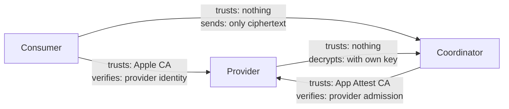

No actor trusts any other actor with plaintext inference data. Specifically:

- **Consumer does not trust the coordinator** with prompt content. The coordinator receives only ciphertext and routing metadata.
- **Consumer does not trust the provider operator** with prompt content. The provider process is hardened (L2) so the operator cannot read process memory.
- **Coordinator does not trust the provider** to report honest capabilities. The coordinator verifies provider identity via App Attest and measures TPS independently.
- **Provider does not trust the coordinator** to pay fairly. The audit log is hash-chained and can be independently verified.

### 1.3 Trust anchors

| Anchor | What it establishes | Who verifies |
|---|---|---|
| Apple App Attest Root CA | Provider app identity on genuine Apple hardware | Coordinator (admission), Consumer (offer verification) |
| Apple code signing (Developer ID) | Binary identity of the provider artifact | macOS Gatekeeper, attestation response |
| X25519 public key binding | Provider's encryption key is bound to its attested identity | Consumer (via admission record) |
| HKDF-derived session keys | Session confidentiality between consumer and provider | Both endpoints |

---

## 2. System Architecture

### 2.1 Component diagram

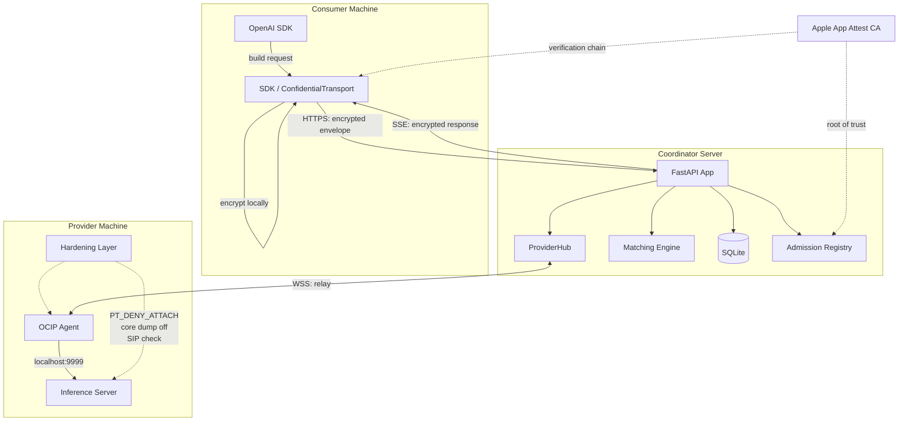

### 2.2 Data flow — what each actor sees

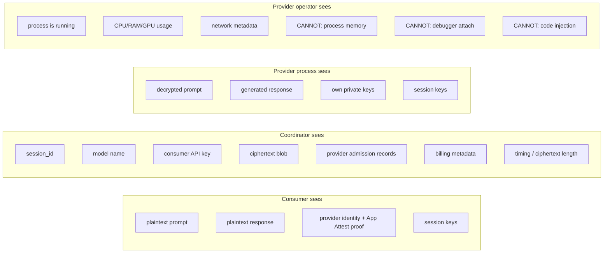

### 2.3 Deployment topology (alpha)

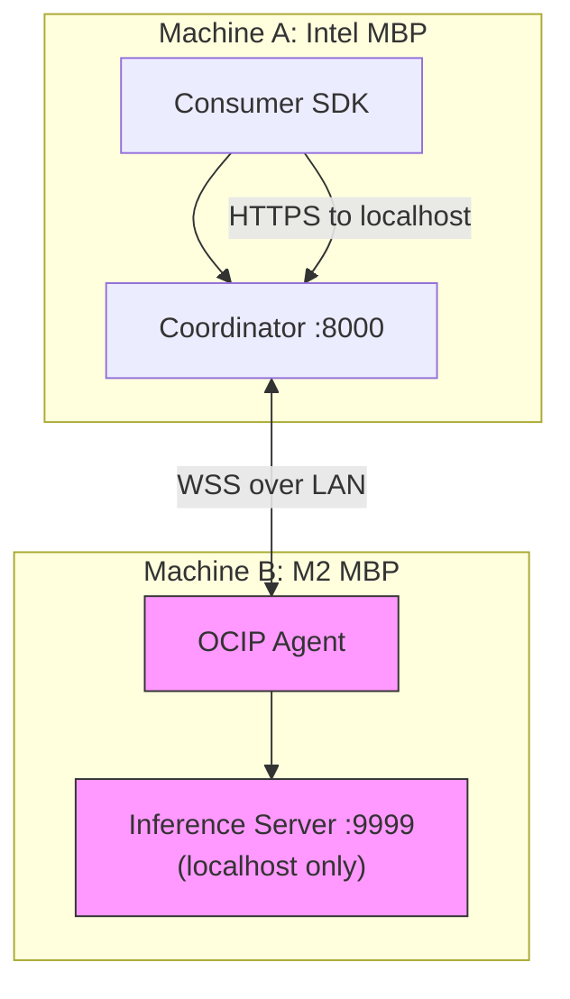

---

## 3. Key Material

### 3.1 Key inventory

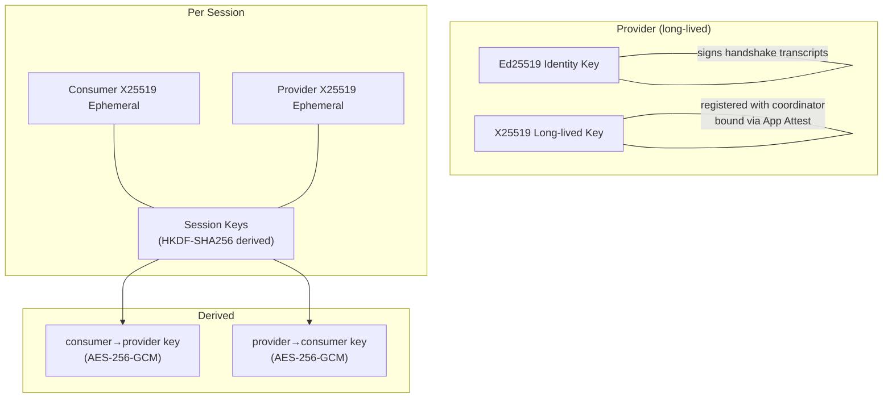

| Key | Type | Lifetime | Created by | Known to |
|---|---|---|---|---|
| Provider identity key | Ed25519 | Long-lived (survives restart) | Provider | Provider, coordinator (public), consumer (public via offer) |
| Provider encryption key | X25519 | Long-lived (per registration) | Provider | Provider (private), coordinator (public), consumer (public via offer) |
| Consumer session ephemeral | X25519 | Per session | Consumer SDK | Consumer (private), provider (public via handshake) |
| Provider session ephemeral | X25519 | Per session | Provider | Provider (private), consumer (public via handshake) |
| Session key (consumer→provider) | AES-256-GCM | Per session | HKDF derivation | Consumer, provider |
| Session key (provider→consumer) | AES-256-GCM | Per session | HKDF derivation | Consumer, provider |
| API key | HMAC-SHA256 bearer | Until revoked | Coordinator | Consumer (raw), coordinator (hash only) |
| Provider token | HMAC-SHA256 bearer | Until revoked | Coordinator | Provider (raw), coordinator (hash only) |

### 3.2 Key lifecycle

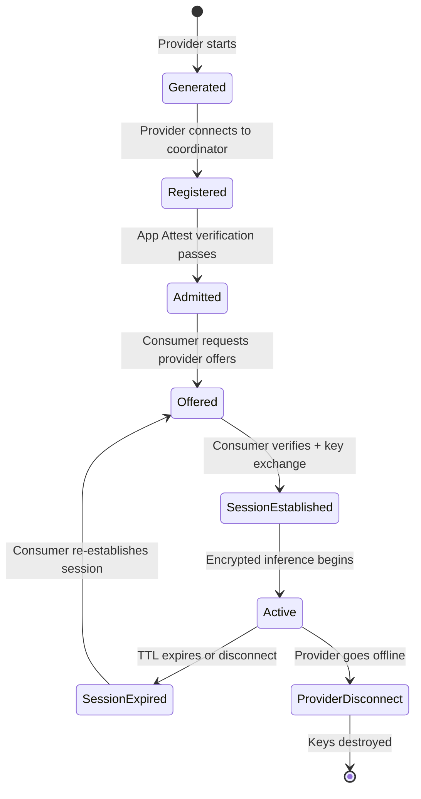

---

## 4. Protocol Sequences

### 4.1 Provider registration and admission

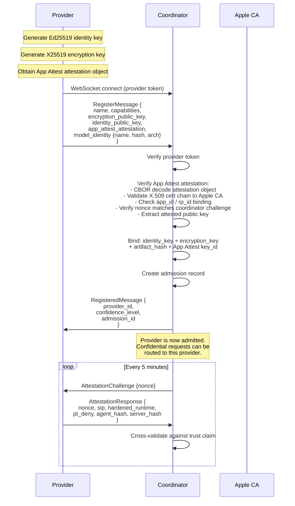

### 4.2 Confidential session establishment

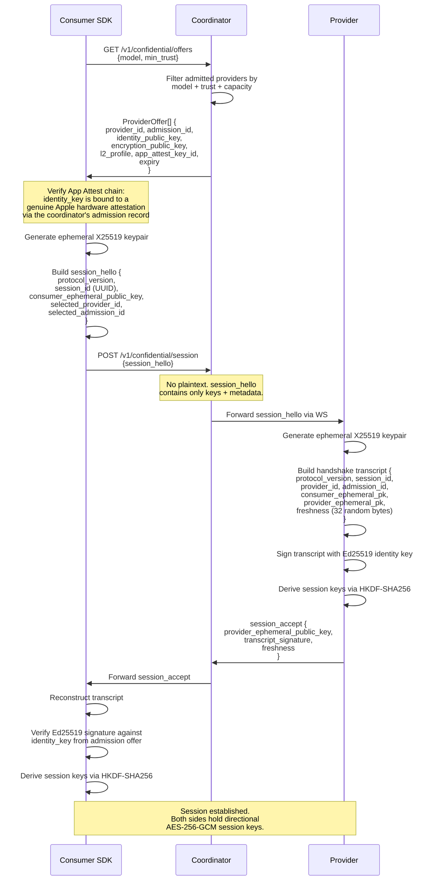

### 4.3 Encrypted inference (happy path)

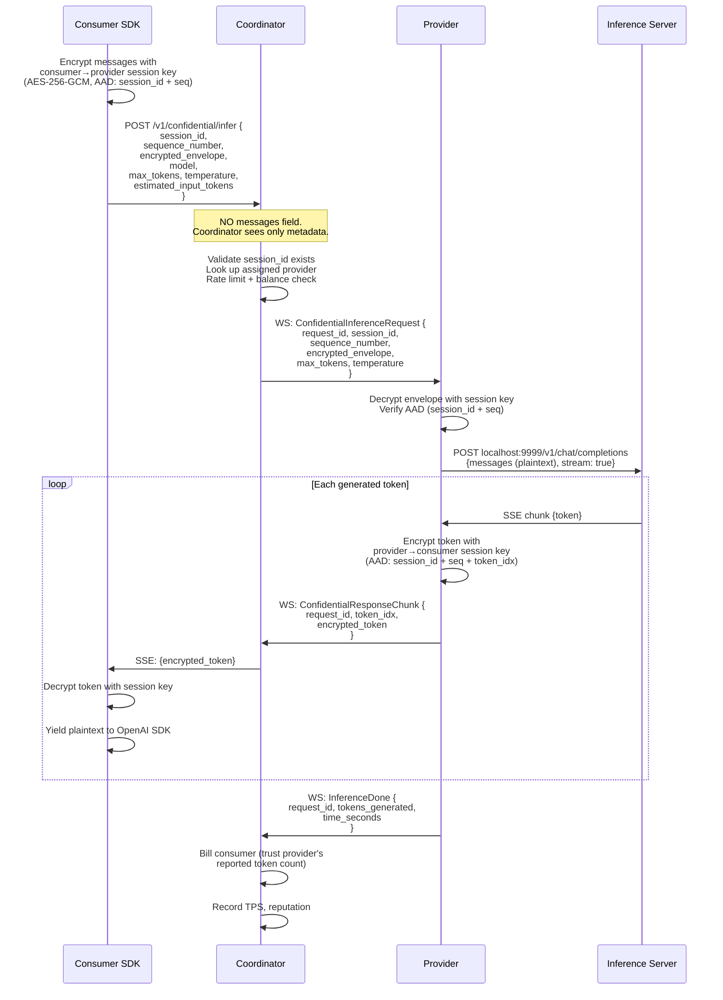

### 4.4 Provider disconnect mid-stream

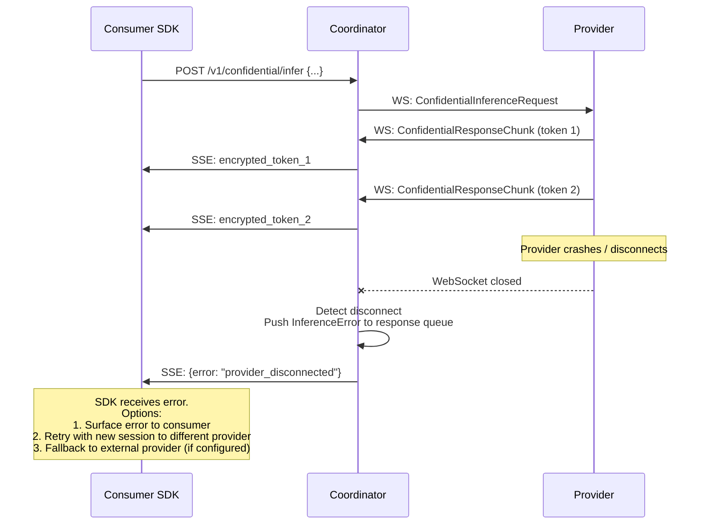

### 4.5 Fallback routing

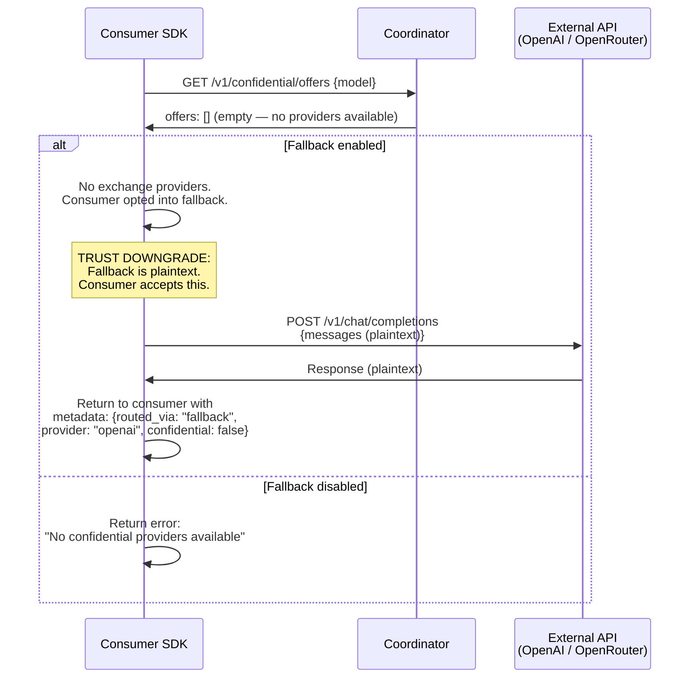

---

## 5. Wire Format

### 5.1 Confidential relay endpoint

**Request:**

```
POST /v1/confidential/infer
Content-Type: application/json
Authorization: Bearer sk-ie-...

{
  "session_id": "uuid",
  "sequence_number": 1,
  "encrypted_envelope": {
    "ciphertext": "base64...",
    "nonce": "base64 (12 bytes for AES-GCM)",
    "tag": "base64 (16 bytes)"
  },
  "model": "llama-3-8b",
  "max_tokens": 1024,
  "temperature": 0.7,
  "stream": true,
  "estimated_input_tokens": 500
}
```

**The `messages` field MUST NOT be present.** The coordinator MUST reject any request to this endpoint that contains a `messages` field.

**Encrypted envelope plaintext (inside ciphertext, only consumer and provider see):**

```json
{
  "messages": [
    {"role": "system", "content": "..."},
    {"role": "user", "content": "..."}
  ]
}
```

**Response (streaming SSE):**

```
data: {"id":"chatcmpl-abc","choices":[{"index":0,"delta":{},"finish_reason":null}],"ocip_encrypted_token":{"ciphertext":"base64","nonce":"base64","tag":"base64"}}

data: {"id":"chatcmpl-abc","choices":[{"index":0,"delta":{},"finish_reason":null}],"ocip_encrypted_token":{"ciphertext":"base64","nonce":"base64","tag":"base64"}}

data: {"id":"chatcmpl-abc","choices":[{"index":0,"delta":{},"finish_reason":"stop"}],"ocip_encrypted_token":{"ciphertext":"base64","nonce":"base64","tag":"base64"}}

data: [DONE]
```

### 5.2 Provider offer discovery

```
GET /v1/confidential/offers?model=llama-3-8b&min_trust=hardened

Response:
{
  "offers": [
    {
      "provider_id": "provider-7",
      "admission_id": "adm-abc123",
      "identity_public_key": "base64 (Ed25519)",
      "encryption_public_key": "base64 (X25519)",
      "l2_profile": "apple-l2-hardened",
      "app_attest_key_id": "base64",
      "models": ["llama-3-8b"],
      "price_per_mtok_output": 0.15,
      "measured_tps": 65.0,
      "trust_level": "hardened",
      "context_length": 8192,
      "available_slots": 2,
      "expires_at": 1694000000
    }
  ]
}
```

### 5.3 Session establishment

```
POST /v1/confidential/session
{
  "session_hello": {
    "protocol_version": "0.2.0",
    "session_id": "uuid",
    "consumer_ephemeral_public_key": "base64 (X25519)",
    "selected_provider_id": "provider-7",
    "selected_admission_id": "adm-abc123"
  }
}

Response:
{
  "session_accept": {
    "session_id": "uuid",
    "provider_ephemeral_public_key": "base64 (X25519)",
    "transcript_signature": "base64 (Ed25519 signature)",
    "freshness": "base64 (32 random bytes)"
  }
}
```

### 5.4 Message types (WebSocket, coordinator ↔ provider)

All existing message types from `shared/protocol.py` remain. New additions for the confidential path:

| Type | Direction | Purpose |
|---|---|---|
| `confidential_inference_request` | Coordinator → Provider | Relay encrypted envelope |
| `confidential_response_chunk` | Provider → Coordinator | Relay encrypted token |
| `session_hello_forward` | Coordinator → Provider | Forward consumer's session hello |
| `session_accept` | Provider → Coordinator | Provider's handshake response |

---

## 6. Crypto Specification

### 6.1 Algorithms

| Purpose | Algorithm | Parameters |
|---|---|---|
| Provider identity signing | Ed25519 | RFC 8032 |
| Key exchange (session) | X25519 ECDH | RFC 7748 |
| Session key derivation | HKDF-SHA256 | RFC 5869, salt = session_id bytes |
| Message encryption | AES-256-GCM | 12-byte nonce, 16-byte tag |
| Request encryption (legacy, on main) | X25519 + XSalsa20-Poly1305 (NaCl Box) | libsodium |

### 6.2 Resolving the two crypto stacks

The codebase currently has two encryption systems:

| | `shared/crypto.py` (on main) | `shared/e2e.py` (PR #24 branch) |
|---|---|---|
| Key exchange | X25519 ephemeral per request | X25519 ephemeral per session |
| Symmetric | XSalsa20-Poly1305 (NaCl Box) | AES-256-GCM |
| Library | PyNaCl (libsodium) | cryptography (OpenSSL) |
| Forward secrecy | Per-request (new ephemeral each call) | Per-session (new ephemeral each session) |
| Session binding | None | session_id + sequence in AAD |
| Replay protection | None (per-request keys make replay useless) | Sequence number in AAD |
| Identity | None (encrypt to any key) | Ed25519 transcript signing |

**Alpha decision:** The confidential path uses `shared/e2e.py` (session-based, AES-256-GCM). The legacy `shared/crypto.py` (NaCl Box) remains for the non-confidential OpenAI-compatible path where the coordinator encrypts on behalf of the consumer.

The two stacks serve different threat models:
- `crypto.py`: coordinator encrypts to provider. Coordinator sees plaintext. Simpler, no session state.
- `e2e.py`: consumer encrypts to provider. Coordinator is blind. Requires session establishment.

### 6.3 Session key derivation

```
ECDH shared secret:
  shared = X25519(consumer_ephemeral_private, provider_ephemeral_public)

HKDF-SHA256:
  salt = session_id (16 bytes, UUID as bytes)
  ikm  = shared (32 bytes)
  info = "ie-confidential-v1-consumer-to-provider" (or "...-provider-to-consumer")

  consumer_to_provider_key = HKDF-Expand(PRK, info_c2p, 32)  → AES-256 key
  provider_to_consumer_key = HKDF-Expand(PRK, info_p2c, 32)  → AES-256 key
```

**Directional keys** prevent reflection attacks where a message encrypted consumer→provider is replayed as a provider→consumer message.

### 6.4 Message encryption

```
AES-256-GCM:
  key   = directional session key (32 bytes)
  nonce = 12 bytes, counter-based: session_seq (8 bytes) + token_idx (4 bytes)
  AAD   = session_id || direction || sequence_number
  plaintext = message content (request JSON or response token)

  ciphertext, tag = AES-GCM-Encrypt(key, nonce, plaintext, AAD)
```

The AAD binding ensures:
- A ciphertext from session A cannot be replayed in session B
- A request ciphertext cannot be presented as a response (direction binding)
- Tokens cannot be reordered (sequence + token_idx binding)

### 6.5 Handshake transcript

The canonical transcript signed by the provider is:

```
transcript = canonical_json({
  "protocol_version": "0.2.0",
  "session_id": "uuid",
  "provider_id": "provider-7",
  "admission_id": "adm-abc123",
  "consumer_ephemeral_public_key": "base64",
  "provider_ephemeral_public_key": "base64",
  "provider_identity_public_key": "base64",
  "freshness": "base64 (32 random bytes)"
})

signature = Ed25519-Sign(provider_identity_private_key, SHA256(transcript))
```

The consumer verifies this signature against the `identity_public_key` from the admission offer. This proves:
- The provider that holds the identity key participated in this specific session
- The session parameters haven't been tampered with
- The freshness value prevents replay of old handshake transcripts

---

## 7. Security Invariants

Each invariant is a testable assertion. Implementation MUST include a test for each.

### 7.1 Coordinator blindness

| ID | Invariant | Test |
|---|---|---|
| CB-1 | The `/v1/confidential/infer` endpoint MUST reject any request containing a `messages` field | Unit test: POST with messages → 400 |
| CB-2 | Coordinator logs MUST NOT contain any plaintext prompt or response content from the confidential path | Grep coordinator logs after a confidential request |
| CB-3 | The coordinator's `routes_inference.py` code path for the confidential endpoint MUST NOT decrypt, parse, or inspect the `encrypted_envelope` | Code review + test: mock envelope with random bytes, coordinator relays it unchanged |
| CB-4 | The response queue relays `ConfidentialResponseChunk` without decrypting `encrypted_token` | Unit test: verify chunk bytes are passed through unchanged |

### 7.2 Consumer verification

| ID | Invariant | Test |
|---|---|---|
| CV-1 | SDK MUST NOT encrypt to a provider whose identity key is not bound to a valid App Attest admission | Unit test: offer with missing/invalid attestation → SDK refuses |
| CV-2 | SDK MUST NOT encrypt to a provider whose admission has expired | Unit test: offer with past expiry → SDK refuses |
| CV-3 | SDK MUST verify the Ed25519 transcript signature before deriving session keys | Unit test: tampered signature → session establishment fails |
| CV-4 | SDK MUST verify the freshness value is unique per session | Unit test: replayed session_accept → rejected |

### 7.3 Provider integrity

| ID | Invariant | Test |
|---|---|---|
| PI-1 | Provider MUST reject requests with mismatched session_id in AAD | Unit test: decrypt with wrong session_id → authentication failure |
| PI-2 | Provider MUST reject requests with out-of-order or replayed sequence numbers | Unit test: replay sequence 1 → rejected |
| PI-3 | Provider MUST reject requests encrypted with the wrong directional key | Unit test: consumer→provider ciphertext presented as provider→consumer → fails |
| PI-4 | Provider MUST NOT log decrypted prompt content | Audit test: check inference server and agent logs after request |

### 7.4 Session isolation

| ID | Invariant | Test |
|---|---|---|
| SI-1 | Session keys from session A MUST NOT decrypt messages from session B | Cross-session decryption test |
| SI-2 | A provider serving multiple concurrent sessions MUST NOT mix tokens between sessions | Concurrent session test: two consumers, verify each gets only their own tokens |
| SI-3 | Session state MUST be destroyed on disconnect or expiry | Verify key material is zeroed after session end |

### 7.5 Financial

| ID | Invariant | Test |
|---|---|---|
| FI-1 | Total consumer spend = total provider earnings + total platform fees (exact, no rounding leak) | Property test: 1000 random billing events |
| FI-2 | No charge is negative | Property test |
| FI-3 | Platform fee = 10% of charge (within integer rounding) | Property test |
| FI-4 | In confidential mode, billing uses the provider's reported token count | Verify the coordinator does not attempt to count tokens from ciphertext |

---

## 8. Error Handling

### 8.1 Error taxonomy

```mermaid
graph TB
    E[Error] --> AUTH[Authentication]
    E --> ROUTE[Routing]
    E --> SESS[Session]
    E --> INFER[Inference]
    E --> BILL[Billing]

    AUTH --> A1[invalid_api_key]
    AUTH --> A2[invalid_provider_token]
    AUTH --> A3[rate_limit_exceeded]

    ROUTE --> R1[no_provider_available]
    ROUTE --> R2[confidence_unavailable]
    ROUTE --> R3[queue_full]
    ROUTE --> R4[queue_timeout]
    ROUTE --> R5[context_too_large]

    SESS --> S1[admission_expired]
    SESS --> S2[admission_invalid]
    SESS --> S3[identity_verification_failed]
    SESS --> S4[transcript_signature_invalid]
    SESS --> S5[session_expired]
    SESS --> S6[replay_detected]
    SESS --> S7[decryption_failed]

    INFER --> I1[provider_timeout]
    INFER --> I2[provider_disconnected]
    INFER --> I3[provider_error]

    BILL --> B1[insufficient_balance]
```

### 8.2 Error responses

All errors follow the structure:

```json
{
  "error": {
    "type": "error_type_from_taxonomy",
    "message": "Human-readable description"
  }
}
```

HTTP status codes:

| Error type | Status | Retryable |
|---|---|---|
| invalid_api_key | 401 | No |
| rate_limit_exceeded | 429 | Yes (after Retry-After) |
| insufficient_balance | 402 | No (add credits) |
| no_provider_available | 503 | Yes (or fallback) |
| queue_full | 503 | Yes (backoff) |
| queue_timeout | 503 | Yes |
| context_too_large | 400 | No (reduce input) |
| admission_expired | 403 | Yes (re-discover offers) |
| identity_verification_failed | 403 | No (provider may be compromised) |
| session_expired | 410 | Yes (re-establish session) |
| replay_detected | 400 | No |
| decryption_failed | 400 | No |
| provider_timeout | 504 | Yes |
| provider_disconnected | 502 | Yes (different provider) |
| provider_error | 502 | Yes |

### 8.3 SDK error recovery

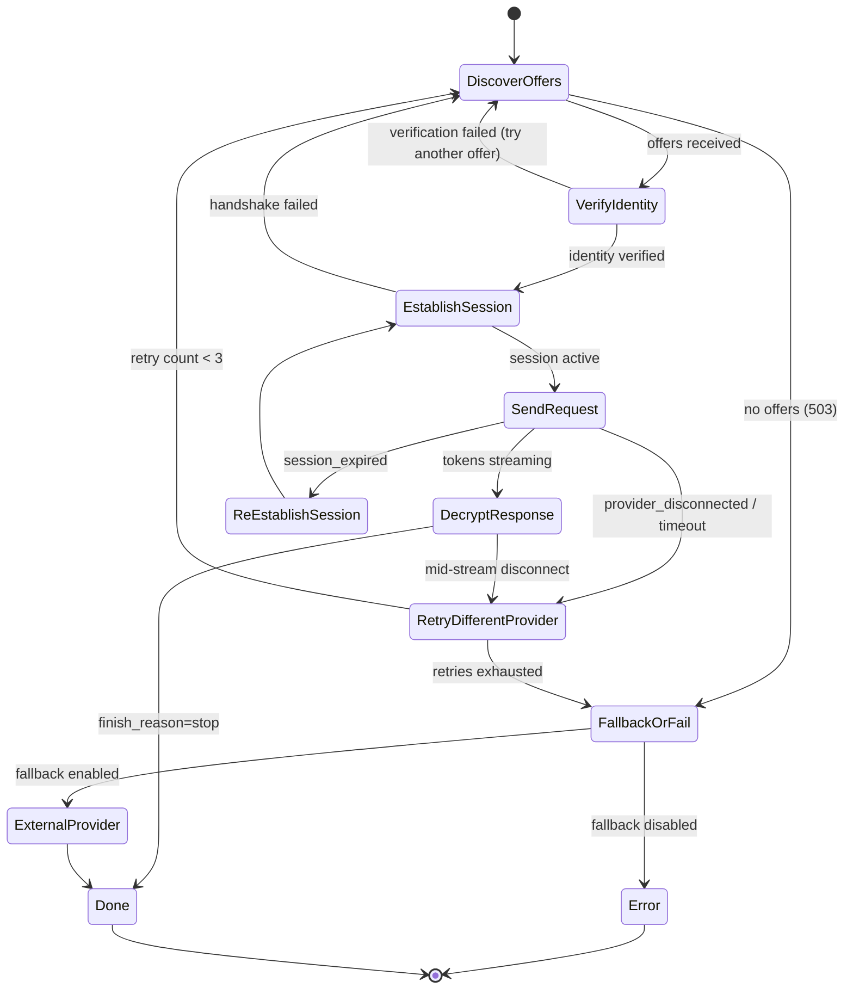

---

## 9. Formal Properties

### 9.1 Confidentiality

**Property C1: Coordinator plaintext exclusion**

For all requests `r` on the confidential path:

```
∀ r ∈ ConfidentialRequests:
  let m = coordinator_observable_state(r)
  ∄ f : m → plaintext(r)
  where f is any computable function
```

The coordinator observes: `session_id`, `model`, `estimated_input_tokens`, `ciphertext`, `ciphertext_length`, `timing`. None of these, individually or combined, yield the plaintext without the session key.

**Assumption:** AES-256-GCM is semantically secure (IND-CCA2). This is a standard assumption.

**Property C2: Provider operator exclusion (L2)**

For all provider operators `o` with user-space/admin access:

```
∀ o ∈ L2Operators, ∀ r ∈ Requests:
  let a = userspace_attack(o, provider_process(r))
  Pr[a recovers plaintext(r)] ≤ negl(λ)
```

**Assumption:** macOS Hardened Runtime + SIP + PT_DENY_ATTACH correctly prevents user-space process memory inspection. This is an Apple platform assumption, not a cryptographic one.

**Known limitation:** This does not hold if the operator has a kernel exploit or physical access.

### 9.2 Authentication

**Property A1: Provider identity binding**

```
∀ sessions s:
  let pk_identity = s.provider_identity_key
  let pk_attest = s.app_attest_key
  
  Verify(pk_identity, s.transcript, s.signature) = true
  ∧ AppAttestBound(pk_identity, pk_attest) = true
  ⟹ s.provider is the genuine admitted provider
```

A consumer only encrypts to a provider whose identity key is bound to a valid App Attest attestation. A malicious coordinator cannot forge this binding without compromising Apple's attestation CA.

**Property A2: Session freshness**

```
∀ sessions s1, s2 where s1 ≠ s2:
  s1.freshness ≠ s2.freshness  (with overwhelming probability)
  ∧ s1.session_keys ≠ s2.session_keys
```

Each session uses fresh randomness, preventing replay of old session establishment messages.

### 9.3 Integrity

**Property I1: Message ordering**

```
∀ tokens t_i, t_j in session s:
  i < j ⟹ t_i.nonce < t_j.nonce
  ∧ ¬∃ t_k : t_k.nonce = t_i.nonce ∧ t_k ≠ t_i
```

Counter-based nonces enforce strict ordering. Duplicate or out-of-order tokens are rejected by AES-GCM authentication.

**Property I2: Session binding**

```
∀ ciphertext c encrypted in session s_a:
  Decrypt(key(s_b), c) = ⊥  for all s_b ≠ s_a
```

The session_id in the AAD ensures ciphertexts are bound to their session.

**Property I3: Direction binding**

```
∀ ciphertext c encrypted consumer→provider:
  Decrypt(provider_to_consumer_key, c) = ⊥
```

Directional key derivation prevents reflection attacks.

### 9.4 Financial integrity

**Property F1: Conservation of value**

```
∀ billing events B:
  Σ consumer_charge(b) = Σ provider_earning(b) + Σ platform_fee(b)
  for b ∈ B
```

No money is created or destroyed. This is enforced by integer arithmetic in micro-USD and tested with property-based tests across 1000 random events.

**Known limitation in confidential mode:** The coordinator trusts the provider's reported `tokens_generated` count because it cannot count tokens in ciphertext. A malicious provider could over-report. Mitigation: TPS anomaly detection flags providers whose reported token counts are inconsistent with elapsed time and their measured throughput.

---

## 10. Deferred to Beta

The following are explicitly out of scope for the Public Alpha:

| Item | Why deferred |
|---|---|
| Attack test suite (#4, #5, #6) | Requires dedicated security testing environment. Alpha validates the architecture; beta validates the hardening. |
| Reproducible builds | PyInstaller builds are not deterministic. Requires Nix or build-from-source infrastructure. |
| Native App Attest client (#22) | Requires Apple Developer Program enrollment and a signed macOS app. Alpha can use dev attestation / mock admission. |
| TLS (#Gap 2 in threat model) | Standard deployment concern. Alpha runs on LAN. |
| Geographic routing | Alpha is LAN-only. |
| Multi-coordinator horizontal scaling | Alpha is single-node. |
| PostgreSQL / Redis | Alpha uses SQLite + in-memory state. |
| Stripe integration (real money) | Alpha uses simulated credits. |
| Context overflow handling (#32) | Important but not a security property. |
| Matching algorithm improvements (#33) | Optimization, not correctness. |
| KV cache measurement (#30) | Performance, not security. |
| Electricity cost model (#31) | Economic, not functional. |
| Formal security audit | Requires third-party engagement. |

---

## References

- [L2 Threat Model](threat-model.md)
- [PCC Comparison](pcc-comparison.md)
- [Architecture](../architecture.md)
- [System Design](../system-design.md)
- Alpha Definition of Done: [Issue #1](https://github.com/qzyu999/inference-exchange/issues/1)
- [Apple App Attest](https://developer.apple.com/documentation/devicecheck/establishing-your-app-s-integrity)
- [Apple Hardened Runtime](https://developer.apple.com/documentation/security/hardened-runtime)
